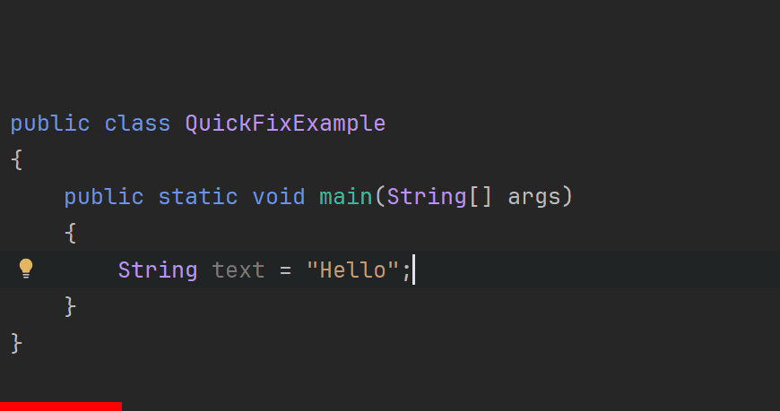

# Viewing Method Arguments in IntelliJ

Sometimes you have a method, which either has several versions or takes multiple arguments, and you want to see what each argument does. IntelliJ provides a way to view method arguments in a convenient way.

The shortcut is <kdb>CTRL</kdb> + <kdb>P</kdb>.

Place the _carret_ inside the parentheses of the method call, and press <kdb>CTRL</kdb> + <kdb>P</kdb>. IntelliJ will show a tool tip with the names and types of the method arguments.

Observe the example here of using the `indexOf()` method:

In the above gif, you can see there are 6 versions of the `indexOf()` method, each with different parameters. Each line is a different version of the method, and the tooltip shows the names and types of the parameters for the version that matches the method call.