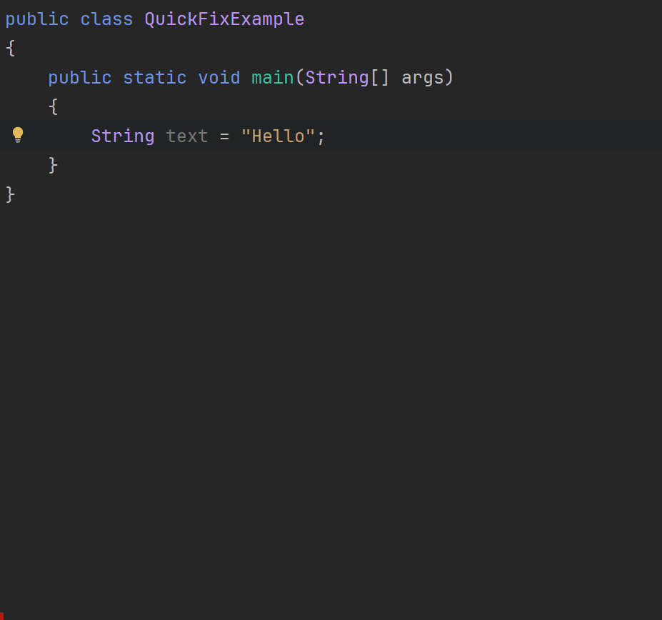
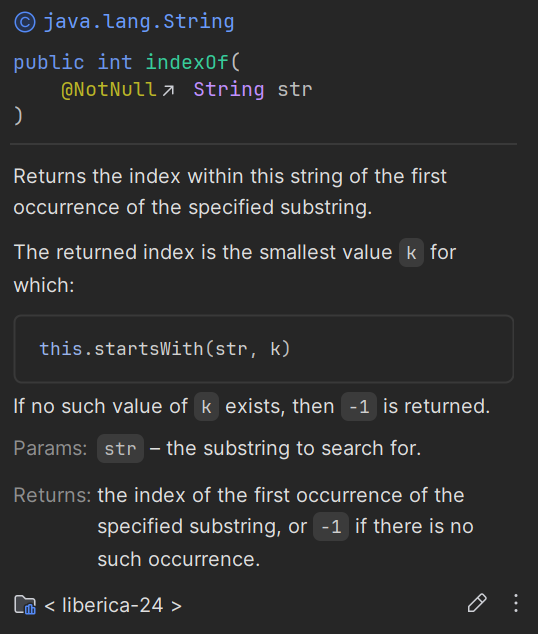

# Method Documentation in IntelliJ IDEA

Occasionaly, you may need to view the documentation for a method while coding in IntelliJ IDEA. This is especially useful when you're unsure about the parameters, return type of a method, or what a method actually does.

The short cut for this feature is <kbd>CTRL</kbd> + <kbd>Q</kbd> .

You write out the method, you wish to call, place the carret on the method name, and press <kbd>CTRL</kbd> + <kbd>Q</kbd>. A tool tip will appear showing the documentation for that method.

Observe:

In this gif you can see how the documentation for the `indexOf()` method is displayed:

