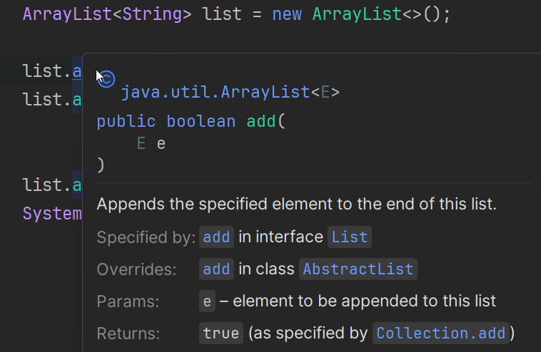

# Introducing JavaDoc

## What is JavaDoc?

JavaDoc is a documentation tool built into Java that allows developers to write documentation directly in their source code. It uses special comment blocks that can be converted into HTML documentation.

Think of JavaDoc as a way to explain your code to other developers (or your future self) without having to maintain separate documentation files. The documentation lives right next to the code it describes, making it easier to keep up to date.

## Why Use JavaDoc?

### Code Maintainability
When you or someone else returns to code months or years later, JavaDoc comments explain what each class and method does, what parameters they expect, and what they return.

### Team Collaboration
In team projects, JavaDoc helps team members understand each other's code without having to read through the implementation details.

### API Understanding
When you use libraries and frameworks, you rely on their JavaDoc to understand how to use their classes and methods. Your code deserves the same treatment.

### Professional Standard
Well-documented code is a sign of professional software development. Most companies and open-source projects expect JavaDoc on public APIs.

## JavaDoc vs Regular Comments

Java has three types of comments:

```java
// Single-line comment - for brief notes in the code

/* Multi-line comment
   Used for longer explanations
   within the code */

/** JavaDoc comment
  * Used for generating documentation
  * Has special tags and structure
  */
```

**Regular comments** explain implementation details to someone reading the code.

**JavaDoc comments** describe the "contract" of a class or method - what it does, what it needs, and what it returns - without revealing how it works internally.

## What Can You Document?

JavaDoc can be used to document:
- Classes
- Interfaces
- Methods
- Constructors
- Fields (especially public constants)
- Enums
- Packages

In the following pages, you'll learn how to write effective JavaDoc comments and generate professional HTML documentation from them.

## Java Doc in IntelliJ

In IntelliJ, you can mouse over variable or method, or click it and press <kbd>CTRL</kbd> + <kbd>Q</kbd>. This will show you the JavaDoc for that variable or method. This can be _very_ useful when you are unsure about the parameters, return type of a method, or what a method actually does.

For example, this is the Java Doc for the `get()` method in the `ArrayList` class:


