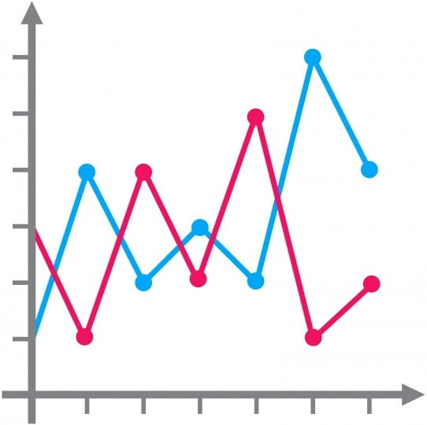

# Building a basic LineChart

`LineChart` plots points on an x-axis and y-axis, and connects them with lines.



In JavaFX, a line chart is built from:

- two axes (`NumberAxis` for numeric data)
- one or more `XYChart.Series<X, Y>`
- data points (`XYChart.Data<X, Y>`)

## Minimal setup

Below, the LineChart is created manually, but you can also use FXML to create it. We want to display numbers on the x and y axes, so we create two `NumberAxis` objects. Alternatively, you can use the `CategoryAxis` class, if you want to display strings on the x axis.

```java
NumberAxis xAxis = new NumberAxis();
NumberAxis yAxis = new NumberAxis();

xAxis.setLabel("Days since mission launch");
yAxis.setLabel("Distance from star (AU)");

LineChart<Number, Number> chart = new LineChart<>(xAxis, yAxis);
chart.setTitle("Mission Telemetry");
chart.setCreateSymbols(false); // cleaner line, without dots at points
chart.setAnimated(false);      // predictable updates
```

The chart can be animated, but it is disabled in the example above. If enabled, the chart will animate the data points, and make a kind of smooth transition, whenever new data points are added.

## Add a data series

A `XYChart.Series<Number, Number>` is a collection of `XYChart.Data<Number, Number>` objects. The generic type parameters are the types of the x and y values. I.e. `Number` for both x and y.

The `XYChart.Data<Number, Number>` object is a data point on the chart. It contains the x and y values of the data point.

Below, we create a new `XYChart.Series<Number, Number>` object and add three data (`XYChart.Data<Number, Number>`) points to it.

```java
XYChart.Series<Number, Number> series = new XYChart.Series<>();
series.setName("Mission Alpha");

series.getData().add(new XYChart.Data<>(1, 0.30));
series.getData().add(new XYChart.Data<>(2, 0.37));
series.getData().add(new XYChart.Data<>(3, 0.45));

chart.getData().add(series);
```

You can add multiple series to the chart, to compare different trends, or just to show different data sets:

```java
XYChart.Series<Number, Number> series2 = new XYChart.Series<>();
series2.setName("Mission Beta");

series2.getData().add(new XYChart.Data<>(1, 0.22));
series2.getData().add(new XYChart.Data<>(2, 0.28));
series2.getData().add(new XYChart.Data<>(3, 0.31));
series2.getData().add(new XYChart.Data<>(4, 0.40));
series2.getData().add(new XYChart.Data<>(5, 0.48));
series2.getData().add(new XYChart.Data<>(6, 0.55));

chart.getData().add(series2);
```

The chart will now show two lines.

## Practical notes

- Keep x-values monotonic (1, 2, 3, ...) for day-by-day trend visualization.
- Use meaningful axis labels. Users should understand units immediately.
- Disable animation for frequently updated charts to avoid jitter.
