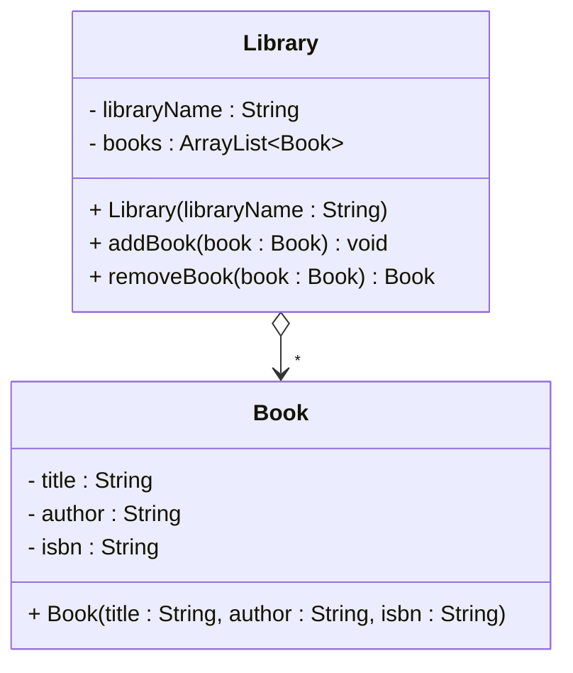

# One to many aggregation

A library can have many books, and books can be transferred between libraries. Only one library at a time has a specific physical copy of a specific book. That sounds like an aggregation.

## Example: Library and Book

```java{3}
public class Library
{
    private String libraryName;
    private ArrayList<Book> books;

    public Library(String libraryName)
    {
        this.libraryName = libraryName;
        this.books = new ArrayList<>();
    }

    public void addBook(Book book)
    {
        books.add(book);
    }

    public Book removeBook(Book book)
    {
        books.remove(book);
        return book;
    }

    public ArrayList<Book> getBooks()
    {
        return books;
    }
}

public class Book
{
    private String title;
    private String author;
    private String isbn;

    public Book(String title, String author, String isbn)
    {
        this.title = title;
        this.author = author;
        this.isbn = isbn;
    }
}
```

Glancing at the code, it looks very much like an association. And again, aggregation is difficult to actually enforce in code. I try to "simulate" it by actually _removing_ the book from the library when it is transferred to another library.

### Transferring ownership

```java
Book novel = new Book("Dune", "Frank Herbert", "978-0441172719");

Library downtown = new Library("Downtown Library");
Library campus = new Library("Campus Library");

downtown.addBook(novel);
// Transfer to another library
downtown.removeBook(novel);
campus.addBook(novel);
```

### Conceptual meaning

The child objects (`Book`) are components of the parent (`Library`), but they can exist independently. Ownership can be transferred. Ownership is stronger than association, but weaker than composition.



