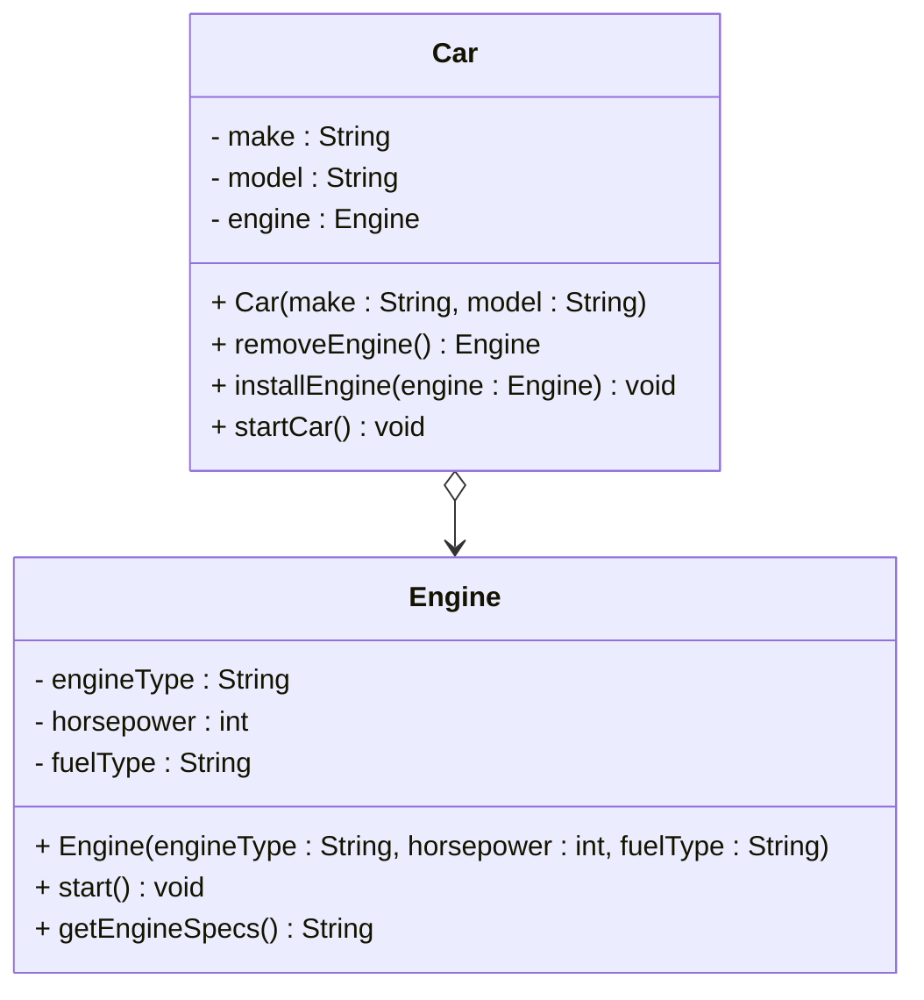
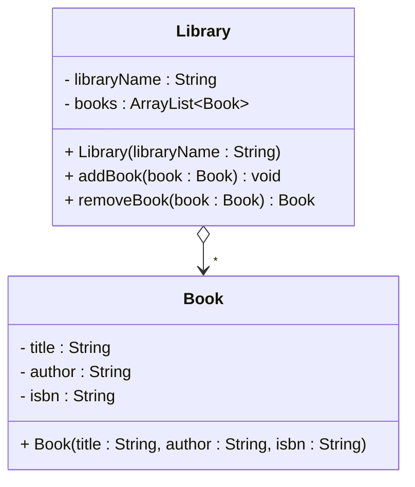

# Aggregation in UML

The aggregation relationship is represented in UML as an arrow with an **empty** (open) diamond at the start, and an open arrowhead at the end.

## One to one

Notice the empty diamond is at the "owner" side, and the open arrowhead is at the "owned" side. Here `Car` knows about `Engine`, but `Engine` does not know about `Car`. Notice also the field variable `engine` in the `Car` class.

We do not put a `1` on the relationship line for one-to-one. We conventionally leave out the multiplicity when aggregating a single object.

## One to many

We use the same empty diamond, and add a star at the arrow head:

## Recap

| Element | Meaning |
| --- | --- |
| Empty diamond (`o-->`) | Aggregation |
| Diamond at the start | The whole / owner side |
| Arrowhead at the end | The part / owned side |
| No multiplicity | One (conventionally omitted) |
| `*` at arrow head | Many parts |

<Quiz>
{
    "Type": "SingleChoiceQuiz",
    "Question": "
Which UML symbol represents aggregation?
",
    "Options": [
        {
            "Text": "Empty diamond at the owner end (<code>o--&gt;</code>)",
            "IsCorrect": true
        },
        {
            "Text": "Filled diamond at the owner end (<code>*--&gt;</code>)",
            "IsCorrect": false
        },
        {
            "Text": "Dashed open arrow (<code>..&gt;</code>)",
            "IsCorrect": false
        },
        {
            "Text": "Solid open arrow with no diamond (<code>--&gt;</code>)",
            "IsCorrect": false
        }
    ],
    "Shuffle": true,
    "Hint": "See the diagrams on this page — empty diamond vs filled diamond.",
    "Explanation": "Aggregation uses an empty diamond. Filled diamond is composition. Dashed arrow is dependency. Solid open arrow without diamond is association."
}
</Quiz>
