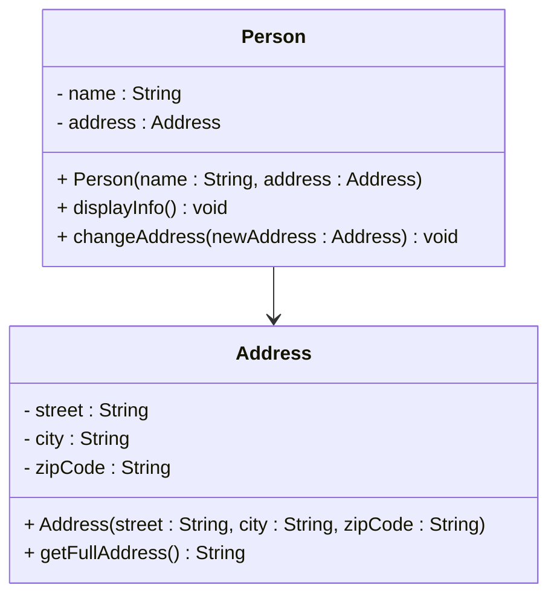

# One to one association

## Example: Person and Address

The `Person` class has a field variable `address` of type `Address`. That is the association.

First the `Address` class:

```java
public class Address
{
    private String street;
    private String city;
    private String zipCode;

    public Address(String street, String city, String zipCode)
    {
        this.street = street;
        this.city = city;
        this.zipCode = zipCode;
    }
    // ...
}
```

And the `Person` class:

```java{4}
public class Person
{
    private String name;
    private Address address;

    public Person(String name, Address address)
    {
        this.name = name;
        this.address = address;
    }

    public void displayInfo()
    {
        System.out.println("Name: " + name);
        System.out.println("Address: " + address.getFullAddress());
    }

    public void changeAddress(Address newAddress)
    {
        this.address = newAddress;
    }
}
```

### Usage

Notice how the `Person` constructor receives an `Address` object. The person can also change address later — loose coupling.

```java{6}
public class AssociationExample
{
    public static void main(String[] args)
    {
        Address homeAddress = new Address("123 Main St", "Springfield", "12345");
        Person person = new Person("John Doe", homeAddress);

        person.displayInfo();

        Address newAddress = new Address("456 Oak Ave", "Riverside", "67890");
        person.changeAddress(newAddress);

        person.displayInfo();
    }
}
```

### Shared references — no ownership

Nothing prevents you from creating another `Person` and passing in the **same** `Address` object. That is because association is loose — there is no ownership.

```java
Address shared = new Address("10 Shared St", "Town", "11111");
Person alice = new Person("Alice", shared);
Person bob = new Person("Bob", shared);
// Both Alice and Bob reference the same Address instance
```

This would then be a "many-to-one" relationship from multiple persons to a single address. The point for now: with association, multiple objects are allowed to know about the same related object.




