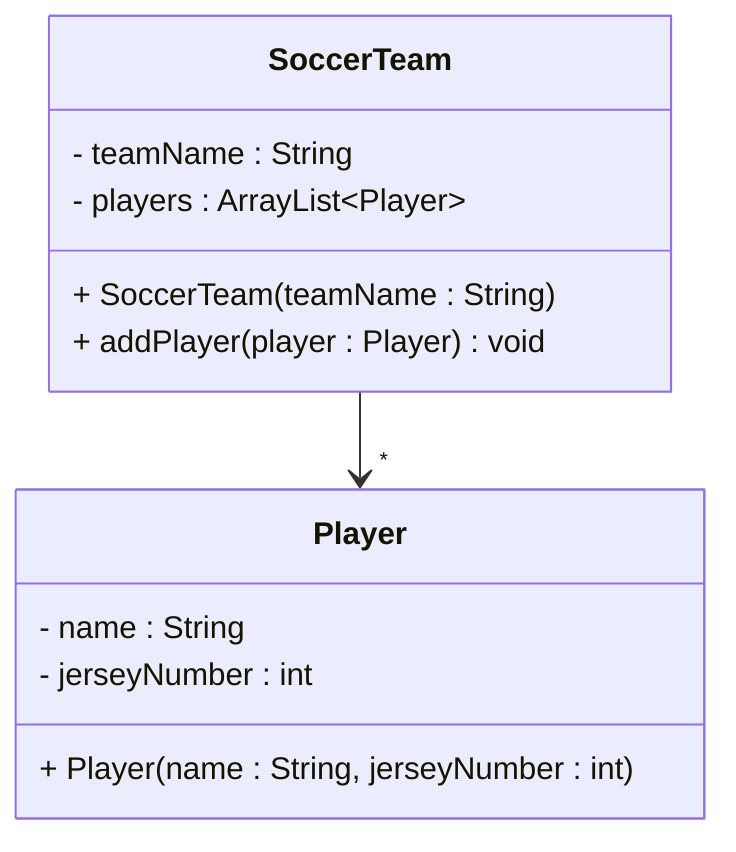

# One to many association

A one-to-many association means one object knows about many objects of the same type through a collection field. There is still no ownership — other objects may also know about those same instances.

## Example: SoccerTeam and Player

A player can sometimes play for multiple teams — for example a local team and a national team. Two teams can reference the same player. That sounds like an association.

This actually makes it a many-to-many relationship, but in this case (and generally) we only _implement_ one side of the relationships.

```java{4}
public class SoccerTeam
{
    private String teamName;
    private ArrayList<Player> players;

    public SoccerTeam(String teamName)
    {
        this.teamName = teamName;
        this.players = new ArrayList<>();
    }

    public void addPlayer(Player player)
    {
        players.add(player);
    }

    public ArrayList<Player> getPlayers()
    {
        return players;
    }
}

public class Player
{
    private String name;
    private int jerseyNumber;

    public Player(String name, int jerseyNumber)
    {
        this.name = name;
        this.jerseyNumber = jerseyNumber;
    }
}
```

### Usage — shared player

```java
Player star = new Player("Alex", 9);

SoccerTeam local = new SoccerTeam("Local FC");
SoccerTeam national = new SoccerTeam("National Team");

local.addPlayer(star);
national.addPlayer(star);
// Both teams know about the same Player instance
```

### Conceptual meaning

For association, the related object (here `Player`) is _not_ part of the parent object (here `SoccerTeam`). It is a separate object that the parent knows about. Other objects can also know about the same child object. There is no strong ownership.


