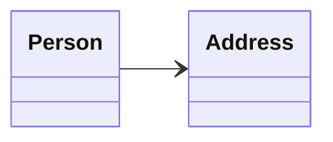
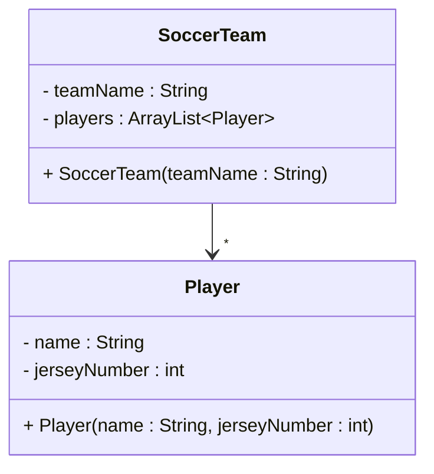

# Association in UML

UML provides a standardized way to represent association relationships between classes.

## Basic association notation

Association is represented by a **solid line** with an open arrowhead at one end.



In code, this is a field variable of type `Address` in `Person`:

```java
public class Person
{
    private Address address;

    public Person(Address address)
    {
        this.address = address;
    }
}
```

## Direction of the arrow

The arrow starts at the class with the field variable and points to the class that is the type of the field variable.

So `Person` knows about `Address`, but `Address` does not know about `Person`. That is a **one-way** (unidirectional) association.

If both objects know about each other, it is a **two-way** (bidirectional) association. Those are quite rare.

## Multiplicity

For one-to-many, add a star (`*`) at the arrow head. In class diagrams we generally only add multiplicity at the end by the arrow head — we do not care how many teams a player plays for unless that side also has a field.



For one-to-one we conventionally leave out the multiplicity (no `1` needed).

## Recap

| Element | Meaning |
| --- | --- |
| Solid open arrow (`-->`) | Association |
| Arrow direction | From the class with the field toward the referenced type |
| `*` at arrow head | Many instances |
| One-way vs two-way | One field vs fields on both sides |

<Quiz>
{
  "Type": "MatchPair",
  "Title": "Match the UML Elements",
  "Pairs": [
    {
      "Prompt": "Solid open arrow (-->)",
      "Answer": "Association"
    },
    {
      "Prompt": "Arrow points to Address",
      "Answer": "Person has a field of type Address"
    },
    {
      "Prompt": "* at the arrow head",
      "Answer": "One-to-many multiplicity"
    },
    {
      "Prompt": "Arrows in both directions",
      "Answer": "Bidirectional association"
    }
  ],
  "Hint": "Review the direction and multiplicity sections on this page."
}
</Quiz>
