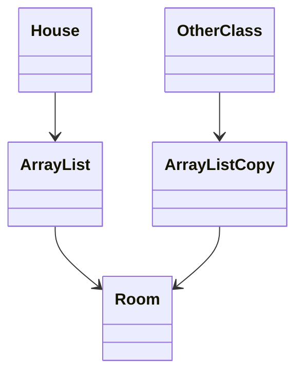
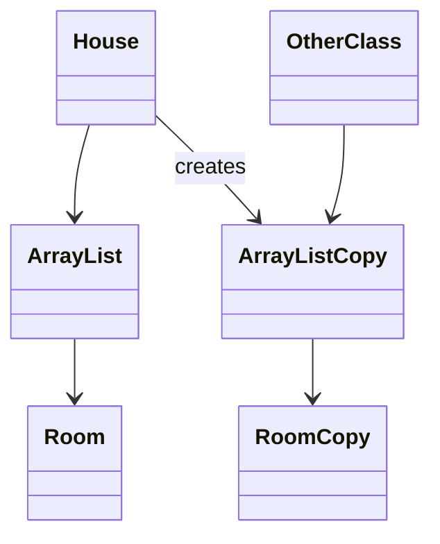

# Returning children safely

Sometimes we want the outside world to get access to composed children. We must still maintain exclusive ownership.

## Single child — return a copy

As seen on the previous page, return a copy of the child, not the original:

```java
public Room getLivingRoom()
{
    return livingRoom.createCopy();
}
```

## Many children — copying the list is not enough

When you have a list, it gets more interesting. Step one might be to return a copy of the list:

```java{12}
public class House
{
    private String address;
    private ArrayList<Room> rooms;

    public House(String address)
    {
        this.address = address;
        this.rooms = new ArrayList<>();
    }

    public ArrayList<Room> getRooms()
    {
        return new ArrayList<>(rooms);
    }
}
```

The above creates a _new ArrayList_ with the same elements.

But is that enough?

> NO!

The House has a reference to an ArrayList. The ArrayList has references to multiple Room objects. The new ArrayList has references to the **same** Room objects.



So `OtherClass` still knows about the same Room objects as the House — not copies, but the actual same objects.

Why is that a problem? Say `Room` has `paintRoom(String color)`. If `OtherClass` calls that method, it changes the House's room without the House controlling it.

What we want instead:



So the code must create a new list **and** create copies of each Room:

```java
public ArrayList<Room> getRooms()
{
    ArrayList<Room> copy = new ArrayList<>();
    for (Room room : rooms)
    {
        copy.add(room.createCopy());
    }
    return copy;
}
```

## Copy all the way down

What if `Room` itself has a composed `Window`? Then you need to copy the `Window` as well. The copy method or copy constructor is good here, because the class itself knows how to copy itself — including its internal parts.

**COPY** COPY Copy copy <sub>copy</sub>, all the way down.


<Quiz>
{
  "Type": "TrueFalseQuiz",
  "Statements": [
    {
      "Text": "return new ArrayList&lt;&gt;(rooms) is enough to preserve composition when Room objects are mutable.",
      "IsCorrect": false
    },
    {
      "Text": "A safe getRooms must copy both the list and each Room inside it.",
      "IsCorrect": true
    },
    {
      "Text": "If Room composes Window, Room's copy method should also copy the Window.",
      "IsCorrect": true
    }
  ],
  "Hint": "Review the 'copying the list is not enough' section and the deep-copy getRooms method."
}
</Quiz>
