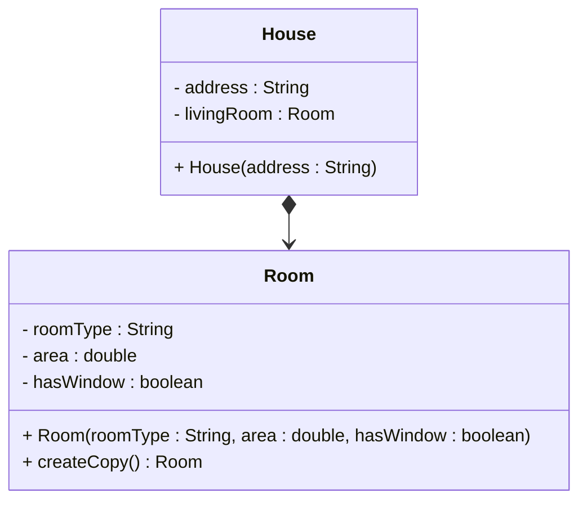
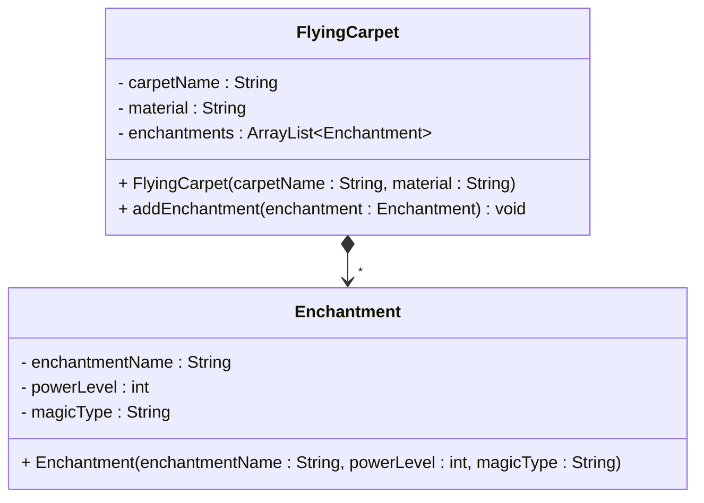
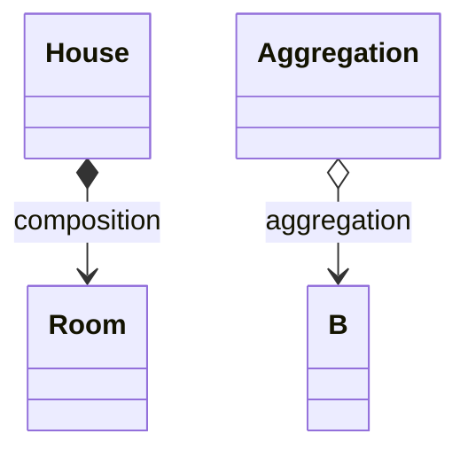

# Composition in UML

In UML, composition is represented by a solid line with a **filled diamond** at one end and an open arrowhead at the other. Aggregation uses an _empty_ diamond — composition uses a filled one.

## One to one



Notice we do not put a `1` on the relationship line for composing one object — multiplicity is conventionally left out.

In code, the Room is created and managed by the House, and no class outside the House accesses that specific Room instance:

```java
public class House
{
    private Room livingRoom;

    public House(String address)
    {
        this.address = address;
        this.livingRoom = new Room("Living Room", 300.0, true);
    }
}
```

The arrow starts at the class with the field (the container) and points to the contained type. So `House` knows about `Room`, but `Room` does not know about `House`.

## One to many

Use the filled diamond and add a star at the arrow head:



## Quick contrast



| Symbol | Relationship |
| --- | --- |
| Filled diamond (`*-->`) | Composition |
| Empty diamond (`o-->`) | Aggregation |

<Quiz>
{
  "Type": "MatchPair",
  "Title": "Match the Diamonds",
  "Pairs": [
    {
      "Prompt": "Filled diamond (*-->)",
      "Answer": "Composition — strong ownership"
    },
    {
      "Prompt": "Empty diamond (o-->)",
      "Answer": "Aggregation — weak ownership"
    },
    {
      "Prompt": "* at the arrow head",
      "Answer": "Many composed parts"
    },
    {
      "Prompt": "Diamond at the House end",
      "Answer": "House is the owner / whole"
    }
  ],
  "Hint": "Review the diagrams and contrast table on this page."
}
</Quiz>
