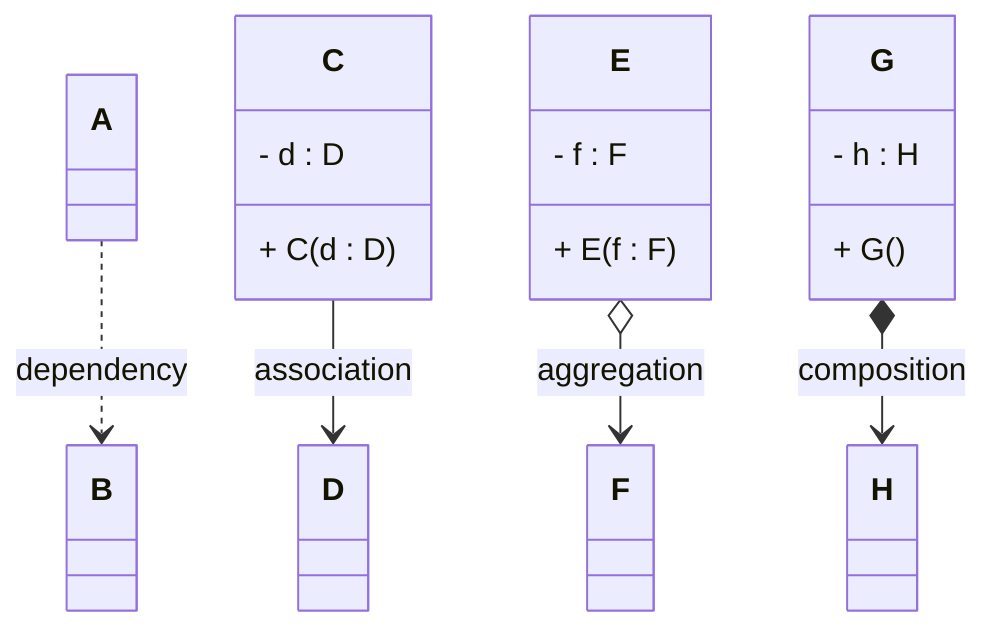

# All four compared

This page quickly recaps the four different relationships, from weakest to strongest:

## Summary

- **Dependency**: A uses B temporarily — weakest relationship. Rarely and only selectively shown in diagrams. Strictly, there is _not_ a field variable involved.
- **Association**: C knows about D — basic relationship. Shown in diagrams. Field variable, no ownership.
- **Aggregation**: E has F as a part — weak ownership. Shown in diagrams, though it rarely affects code because we cannot enforce it.
- **Composition**: G owns H completely — strongest relationship. Shown in diagrams. Exclusive ownership, often enforced with internal creation and copies.

## Choosing which one

| Question | Likely answer |
| --- | --- |
| Used only in a method, not stored? | Dependency |
| Field reference, objects independent, can be shared? | Association |
| Whole-part, part can be transferred? | Aggregation |
| Whole-part, exclusive, part dies with whole? | Composition |

When in doubt between aggregation and association: association is usually fine. Save composition for when exclusive ownership really matters — and be ready to protect it with copies.

<Quiz>
{
    "Type": "SingleChoiceQuiz",
    "Question": "
From weakest to strongest, which order is correct?
",
    "Options": [
        {
            "Text": "Dependency, Association, Aggregation, Composition",
            "IsCorrect": true
        },
        {
            "Text": "Composition, Aggregation, Association, Dependency",
            "IsCorrect": false
        },
        {
            "Text": "Association, Dependency, Composition, Aggregation",
            "IsCorrect": false
        },
        {
            "Text": "Aggregation, Dependency, Association, Composition",
            "IsCorrect": false
        }
    ],
    "Shuffle": true,
    "Hint": "See the diagram and summary list on this page.",
    "Explanation": "Weakest to strongest: Dependency → Association → Aggregation → Composition."
}
</Quiz>
