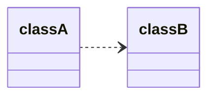
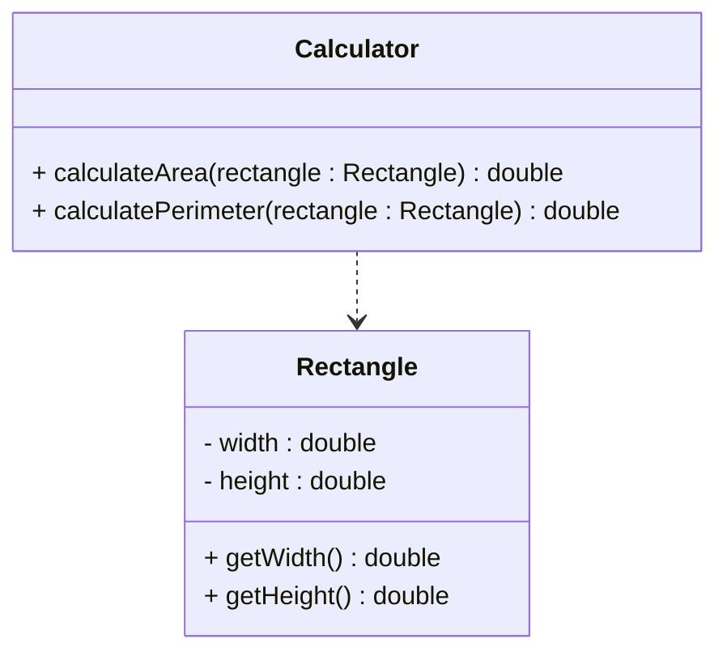

# Dependency in UML

In UML class diagrams, dependency is represented by a **dashed line** with an open arrowhead.

## Basic notation

The arrow starts at the class that depends on another class and points to the class that is depended upon.

So `classA` depends on `classB`, but `classB` does not know about `classA`.

## Example: Method parameter

## When to show dependencies

Dependencies are often left out of UML diagrams because they can quickly clutter the picture. Show a dependency when:

1. **Method parameters**: One class uses another as a method parameter
2. **Local creation**: One class creates another locally within methods
3. **Static calls**: One class calls static methods of another
4. **Important relationships**: When the dependency is significant to the design

You can also, sometimes, show that a class depends on a package. This is useful if a class depends on several classes in this other package.

If a stronger relationship exists (association, aggregation, or composition), show that instead. Always show the strongest relationship.

