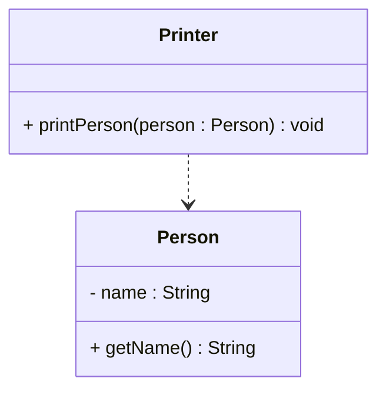
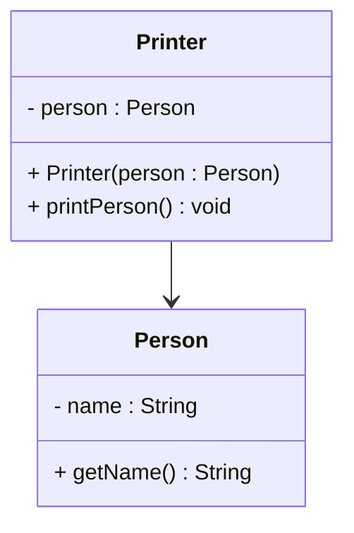

# Dependency vs association

The difference between dependency and association is whether a **field variable** stores the reference.

## Same classes, two relationships

### Version 1: Dependency (method parameter only)

```java
public class Printer
{
    public void printPerson(Person person)
    {
        System.out.println(person.getName());
    }
}
```

`Printer` uses `Person` temporarily. When `printPerson` finishes, the relationship is gone. No field stores a `Person`.



### Version 2: Association (field variable)

```java
public class Printer
{
    private Person person;

    public Printer(Person person)
    {
        this.person = person;
    }

    public void printPerson()
    {
        System.out.println(person.getName());
    }
}
```

Now `Printer` stores a permanent reference to `Person`. That is an **association**, not a dependency.



## Rule of thumb

| Situation | Relationship |
| --- | --- |
| Other class appears only as a parameter, local variable, return type, or static call | Dependency |
| Other class appears as a field variable | Association (or stronger) |

When both apply, show the stronger one. A class that has a field of type `Person` and also takes a `Person` as a method parameter is still drawn as an association.
