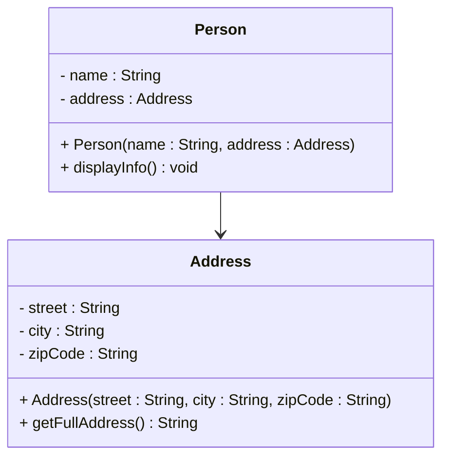

# One to one

A **one-to-one** relationship means one object references exactly one other object.

The short version: one class has a field variable whose type is another class. That field holds a reference to a single instance.

## Example: Person and Address

First the `Address` class:

```java
public class Address
{
    private String street;
    private String city;
    private String zipCode;

    public Address(String street, String city, String zipCode)
    {
        this.street = street;
        this.city = city;
        this.zipCode = zipCode;
    }

    public String getFullAddress()
    {
        return street + ", " + city + " " + zipCode;
    }
}
```

And the `Person` class. Notice the field variable `address` of type `Address` — that is the relationship.

```java{4}
public class Person
{
    private String name;
    private Address address;

    public Person(String name, Address address)
    {
        this.name = name;
        this.address = address;
    }

    public void displayInfo()
    {
        System.out.println("Name: " + name);
        System.out.println("Address: " + address.getFullAddress());
    }
}
```

### Usage

```java{4-5}
public class Main
{
    public static void main(String[] args)
    {
        Address home = new Address("123 Main St", "Springfield", "12345");
        Person person = new Person("John Doe", home);

        person.displayInfo();
    }
}
```

### UML

In UML we draw a solid arrow from the class that holds the field to the class it references:



This kind of relationship — one object knowing about another through a field — is called an **association**. You will see more about that in a dedicated learning path.

<Quiz>
{
    "Type": "SingleChoiceQuiz",
    "Question": "<p>What creates a one-to-one relationship between <code>Person</code> and <code>Address</code>?</p>",
    "Options": [
        {
            "Text": "A field variable of type <code>Address</code> inside <code>Person</code>",
            "IsCorrect": true
        },
        {
            "Text": "A static method call from <code>Person</code> to <code>Address</code>",
            "IsCorrect": false
        },
        {
            "Text": "Two classes with the same package name",
            "IsCorrect": false
        },
        {
            "Text": "An <code>ArrayList</code> of addresses",
            "IsCorrect": false
        }
    ],
    "Shuffle": true,
    "Hint": "Look at the field variables in the Person class on this page.",
    "Explanation": "A one-to-one relationship is created by a field that holds a single reference to another object."
}
</Quiz>
