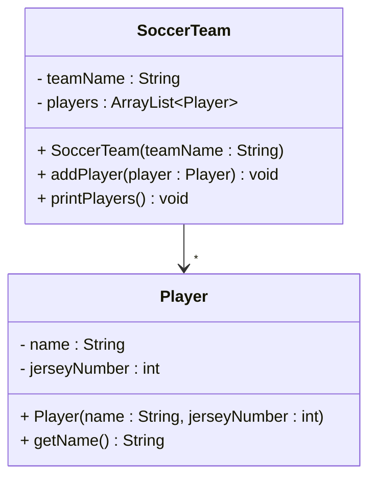

# One to many

A **one-to-many** relationship means one object references many objects of the same type.

In Java we typically use an `ArrayList` (or another collection) as the field variable.

## Real-world examples

One object knowing many others is common:

- A soccer team has many players
- A playlist contains many songs
- A library has many books
- A company has many employees
- A shopping cart has many products
- A book has many chapters

## Example: SoccerTeam and Player

Here the `SoccerTeam` class holds an `ArrayList` of `Player` objects:

```java{4,9,12-15}
public class SoccerTeam
{
    private String teamName;
    private ArrayList<Player> players;

    public SoccerTeam(String teamName)
    {
        this.teamName = teamName;
        this.players = new ArrayList<>();
    }

    public void addPlayer(Player player)
    {
        players.add(player);
    }

    public void printPlayers()
    {
        for (Player player : players)
        {
            System.out.println(player.getName());
        }
    }
}
```

And a simple `Player` class:

```java
public class Player
{
    private String name;
    private int jerseyNumber;

    public Player(String name, int jerseyNumber)
    {
        this.name = name;
        this.jerseyNumber = jerseyNumber;
    }
    // ...
}
```

Notice three important details:

1. The field is an `ArrayList<Player>`, not a single `Player`
2. The list is instantiated in the constructor (`new ArrayList<>()`)
3. Players are added through an `addPlayer` method

### Usage

```java
public class Main
{
    public static void main(String[] args)
    {
        SoccerTeam team = new SoccerTeam("FC Coders");
        team.addPlayer(new Player("Alice", 10));
        team.addPlayer(new Player("Bob", 7));
        team.printPlayers();
    }
}
```

### UML

We use the same solid arrow as one-to-one, but add a star (`*`) at the arrow head to show "many":



Like the one-to-one example, this is also an **association** — just with many related objects instead of one.


