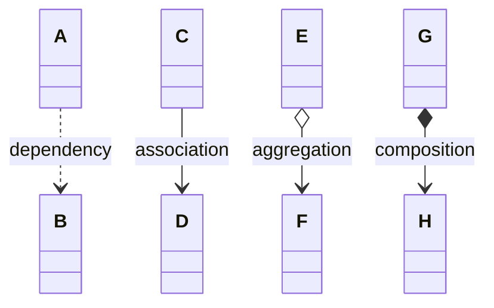

# Kinds of relationships

So far you have seen how to create one-to-one and one-to-many relationships in code. Both used a field variable that references another object (or many objects). That is the basic idea of an association.

But not all relationships are the same. Ownership, lifecycle, and how permanent the link is all matter. There are four common kinds, listed from weakest to strongest:

| Relationship | Short meaning |
| --- | --- |
| **Dependency** | One class uses another temporarily — no field variable stores the reference |
| **Association** | One object knows about another through a field — no ownership |
| **Aggregation** | Whole-part relationship with weak ownership — the part can exist independently |
| **Composition** | Whole-part relationship with strong ownership — the part cannot exist independently |

In UML they look like this (weakest to strongest):

Each of these has its own learning path where you will go into the details — including code patterns, UML notation, and how one-to-many fits each kind.

