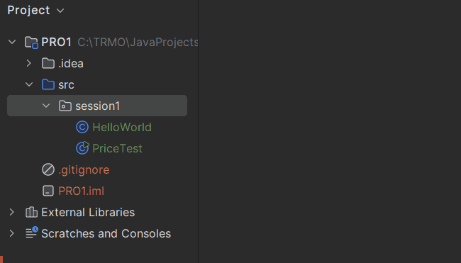
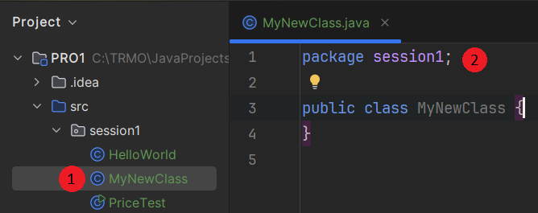

# Classes

A class is also something we will elaborate on later.

For now, each exercise will be a new class (or java file), with a `main` method inside it.

Watch here how a new class is created in IntelliJ IDEA: 

And the end result looks like this:

Notice a new file is created in the session1 package ((1)). Notice also, that the same package name is declared at the top of the file ((2)).

Packages are essentially folders, they are a way to organize your code. In Java, we just call them packages. If you open a file explorer, you will see that the folder structure inside *src* is the same as the package structure you see in IntelliJ IDEA.