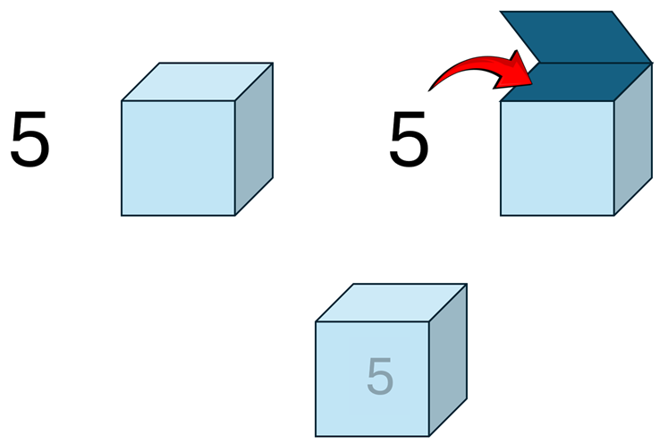

# Variables

Every program works with data, and in Java, we use *variables* to store and manipulate this data. 

Think of a variable as a box. You can put things inside the box, and you can take things out of the box.




You may be familiar with a similar concept from mathematics, where a variable can represent a number or an unknown value. In programming, variables can hold different types of data, such as numbers, text, or even more complex objects (introduced later in the course).

> x = 5

In this example, `x` is a variable that holds the value `5`. You can think of it as a box labeled `x` that contains the number `5`.

You can pass the box around to different people. They can look inside, and find the value `5`.

In Java, we can declare variables, but we must also define its "type". The type of a variable determines what kind of data it can hold.\
At home, you might have a box for your socks, and a box for your shoes. You cannot put shoes into the sock box, and you cannot put socks into the shoe box.

For example, if you want to store a whole number (1, 2, 3, etc), you would use the `int` type, and if you want to store a decimal number (3.14, 1.5, etc), you could use the `double` type.\
If you want to store some text, you would use the `String` type.

Here is how you can declare a variable in Java:

```java
int x = 5; 
double y = 3.14; 
String name = "Alice"; 
```

In this example:
- `int x = 5;` declares a variable `x` of type `int` and assigns it the value `5`.
- `double y = 3.14;` declares a variable `y` of type `double` and assigns it the value `3.14`.
- `String name = "Alice";` declares a variable `name` of type `String` and assigns it the value `"Alice"`.

Walk through those lines as a sequence: pick a type, name the box, put a value in, then use it.

<Quiz>
{
    "Type": "StepGuide",
    "Title": "Using a variable",
    "Details": [
        {
            "Header": "A typed box",
            "Content": "<p>A variable is a box that holds a value. The type decides what you are allowed to put in the box, like <code>int</code>, <code>double</code>, or <code>String</code> in the examples above.</p>"
        },
        {
            "Header": "Choose a type",
            "Content": "<p>Pick the type that matches the data. Use <code>int</code> for a whole number, <code>double</code> for a decimal number, or <code>String</code> for text.</p>"
        },
        {
            "Header": "Declare a name",
            "Content": "<p>Give the box a name, such as <code>x</code>, <code>y</code>, or <code>name</code>. That name is how you find the box later.</p>"
        },
        {
            "Header": "Assign a value",
            "Content": "<p>Use <code>=</code> to put a value into the box, for example <code>int x = 5;</code>. The type and name come before <code>=</code>, and the value comes after it.</p>"
        },
        {
            "Header": "Use the value",
            "Content": "<p>Once the box has a value, you can use the name to read it, for example by printing it. This filling of the box is called an <strong>assignment</strong>.</p>"
        }
    ]
}
</Quiz>

We use the `=` operator to assign a value to a variable. Or, put a value into the box.\
This is called an **assignment**. The variable type and name comes before the `=` sign, and the value comes after it. We assign the value to the variable.