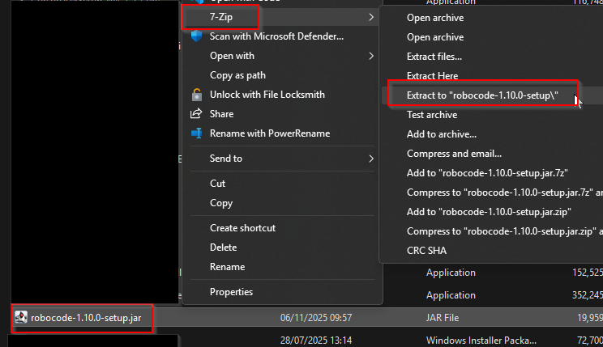

# Installing Robocode

I recommend downloading the jar file from Itslearning. It is just faster. It is version 1.9.5.5.

Alternatively, you can download the latest version of Robocode from the official website: [Robocode Download](https://sourceforge.net/projects/robocode/files/robocode/).

It took about 30 minutes for me.

## Installation.

Watch my video here on how I install Robocode.

You don't need to make the same setup choice as me, but I will argue my choice.

<video src="https://youtu.be/blTsMIoXog0"></video>

## Can't open the jar file?

When actually doing this in class, several of my students had problems opening the jar file. Double clicking it did not work, windows asked which program they wanted to use to open it.

If that is your case, you can instead try the following:
- Right click the jar file
- Find the 7-zip program in the list, you may have to look at the bottom for "more options" or something like that.
- Use the 7-zip program to extract the contents of the jar file into a new folder.

That should result in the same folder as the installation, and you can continue with the learning path.