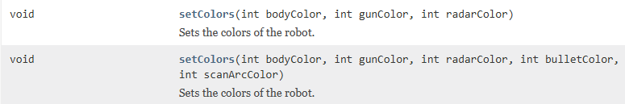

# Colors

If you look at the JuniorRobot API documentation, linked on the previous page, you will first see some color constants:


There are several colors, if you scroll further down.
These are just predefined, so they can be used when setting the colors of your robot, instead of manually defining the color with an integer.\
Like this:

```java
setColors(black, blue, brown);
```

The color constants are defined as public field variables in the JuniorRobot class, and so we have access to them.

You may notice in the documentation, there are two ways to set the colors:

