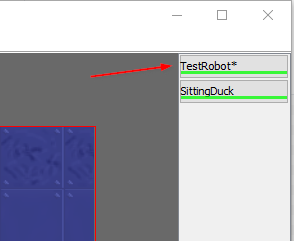

# Printing to console

In a previous video, I showed that when a fight is going on, you can click on a robot in the right-hand-side panel, and see the console for that robot:



To print to the console, you can use the `out.println()` method, like this:

```java
out.println("Moving forward");
```

Notice you do not have the usual `System` in front, as _this_ `out` is a field variable in the JuniorRobot class.

Use the `println(..)` method for information about what your robot is doing.