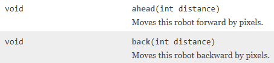
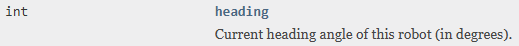

# Moving your robot

You have several ways of moving and rotating your robot. 

## Move

You can move back and forth with:

## Rotation

And you can rotate the robot with:

Then there is the `turnTo` method, 
which will rotate the robot's heading to the specified angle. 

North is 0, and then clock-wise you have 360 degrees.

## Move and turn

The following four methods will both move and turn your robot:

## Current heading

You can get the current heading of your robot, i.e. which direction is it facing, with the field variable `heading`:

Again, heading 0 is up. And then clock-wise you have 360 degrees.

