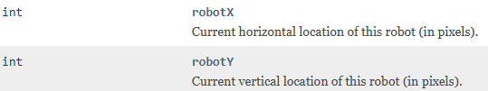
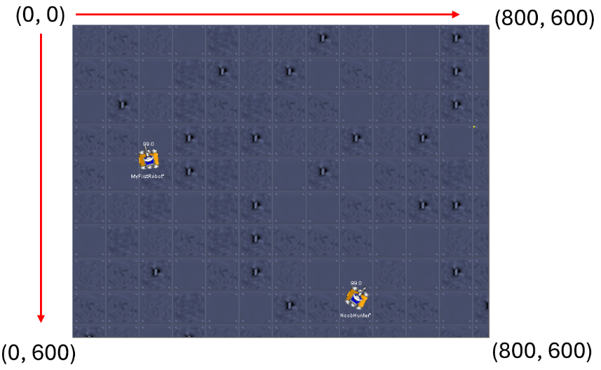

# Robot location

It may be useful to know where your robot is located on the battle field.

You can get the x and y coordinates of your robot through the fields:

Notice these are field variables in JuniorRobot, _not_ get-methods to be called.

The battle field coordinates are pixels, and the top left corner is (0, 0).

