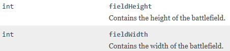

# Battle field size

As a follow-up to where your robot is, you may want to know the dimensions of the battlefield, for example to avoid edge collisions.

For example, if you are close to the right side edge, heading right, you may want to turn around instead, to avoid hitting the edge.