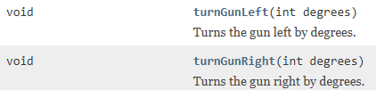

# Scanning

The scanner is used to find other robots.

## Rotating the scanner

As mentioned in a previous video, the scanner and the gun always moves together.\
So, if you want to look for another robot, you have to rotate your gun.\
You can to this with the methods:



The gun will rotate a number of degrees according to the argument.
If you insert 360, the gun and scanner will do one full rotation.

```javascript
@Override
public void run()
{
    while(true){
        turnGunRight(360);
    }
}
```


## Scan data

You should override the `onScannedRobot` method, which is called when the scanner finds another robot.

Whenever another robot is scanned, a couple of field variables in JuniorRobot are updated, i.e. information about the scanned robot.

Take a look at the method here:

```java
@Override
public void onScannedRobot()
{
    out.println("Gun heading: " + gunHeading);
    out.println("robot angle: " + heading);
    out.println("scanned bearing: " + scannedBearing);
}
```

At this point here, when the scanner arc this the robot, the method is called.


And the print out is:

> Gun heading: 74\
> robot angle: 334\
> scanned bearing: 97

What does this mean?

### Gun heading

The `gunHeading` field variable is the current heading of the gun, i.e. the angle it is facing.\
This is the absolute angle, i.e. 0 is up, and then clock-wise you have 360 degrees. So, from up, you rotate 74 degrees clock-wise, and there you find the opponent.

### Robot angle

This is the heading of the robot, i.e. currently the blue robot is facing up and a little to the right. Sort of north-north-west.

### Scanned bearing
The `scannedBearing` is the angle from the robot to the scanned robot.\
That means it is an angle relative to the blue robot's current heading.