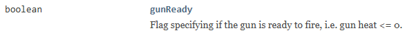
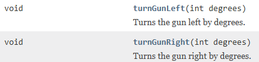

# Gun handling

The gun is controlled by rotating and firing it.

## Heat

Firing the gun will increase heat, and you can't fire if the gun is hot. 
Heat decreases over time. This field variable indicates if the gun can fire.



## Gun rotation

You have already seen that the gun can be rotated with:



The gun will rotate a number of degrees according to the argument.

Sometimes you want to rotate to a specific absolute rotation, i.e. not affected by the heading of the robot.\
This is useful when you have scanned another robot, and knows the absolute angle to this opponent (see previous page).

## Shoot

The following code will first rotate the gun and, if possible, fire it:

```java
bearGunTo(targetAtBearing);
if (gunReady)
{
    fire();
    out.println("shoot");
}
```