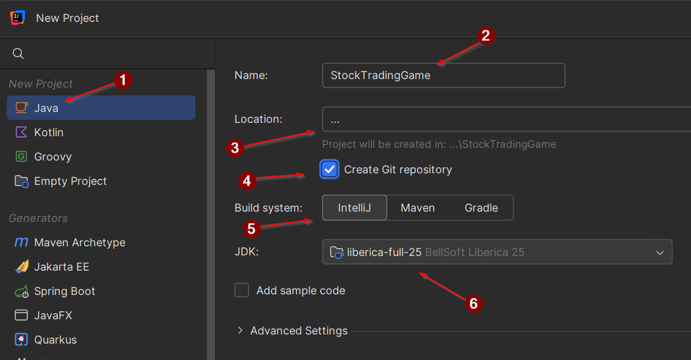

# New project

Create a new project in IntelliJ. It is easier to check the box for adding git repository right away.

((1)) Select "Java"\
((2)) Choose a name\
((3)) Choose a location\
((4)) Check the box for adding git repository\
((5)) Select IntelliJ as build system\
((6)) Pick "Liberica-full" as JDK. Either use your existing version, or upgrade to the latest release. The version is less important. But we will use JavaFX, so "Liberica-full" is the best choice.

Create the project.