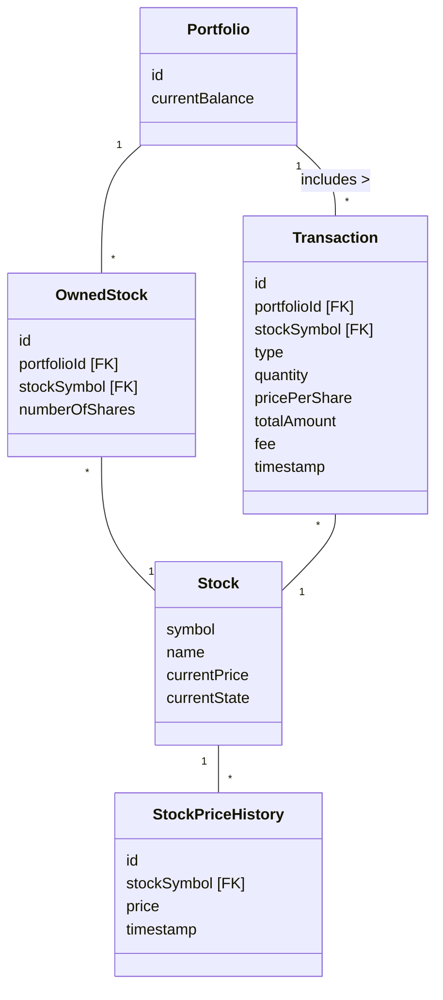

# Domain entities

Create the domain entity classes for the game.

Remember to add or choose primary keys for all entities.

Also remember to model relationships with foreign keys, rather than object references.

## Data model

Below, you can find a data model. It is _almost_ a domain model, but I have kindly added foreigns keys for your convenience.

Most entities have an id field, this is a unique identifier for the entity.\
Some entities have a foreign key field, this is a reference to another entity. These attributes are marked with [FK].

`Stock::currentState` stores the state name as a `String` (e.g., `"Steady"`, `"Growing"`, `"Declining"`, `"Bankrupt"`, `"Reset"`).  

## Task

Implement the domain entities in Java. Add relevant constructors, getters for all fields, and the necessary setters.

Do consider which fields should be final (i.e. immutable).