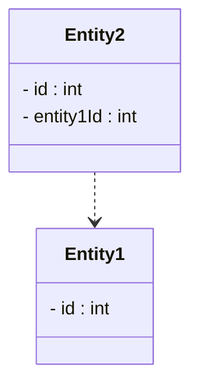

# Class diagram

Create a class diagram for your domain entities. Include the relevant packages as well.

As there are no associations between the entities, because of the foreign keys, you should instead use the dependency arrow.

You should still add multiplicities, if relevant.