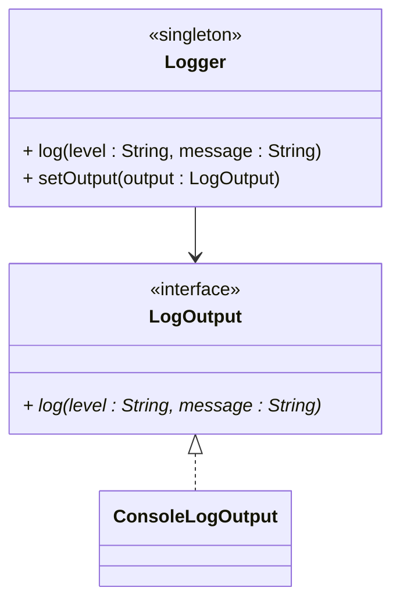

# Logging

Many systems need to log information to _somewhere_, usually a file, we will start with the console.\
This is sometimes used just to be able to track what is happening in the system. But more importantly, if something goes wrong, we can use the logs to debug the issue.

Have you ever had a program crash on you, and you were asked if you wanted to send a crash report to the developer? That's because the program has logged information about the crash, and the developer can use this information to debug the issue.


## Explanation

You will create a new class called `Logger`. We want to be able to eventually change the output of the logging, but for now we will just log to the console.

## Package

Inside the "shared" package, create a new package called "logging".

## Design


The `Logger` classshould be a singleton.

You will also need a `LogOutput` interface, which will be _used by_ the `Logger` class, i.e. the `Logger` has an association to the `LogOutput` interface.

The interface is implemented by the `ConsoleLogOutput` class.

Here is a rough outline of the class diagram:



## Implementation

Implement the three classes/interface in Java.

The `log()` method in the `Logger` class should simply call the `log()` method on the `LogOutput` instance, passing both the level and message.

The implementation of the `log()` method in the `ConsoleLogOutput` class should print the message to the console with the log level formatted as a prefix, e.g., `[INFO] message` or `[ERROR] message`.

**Log Levels:**
- `"INFO"` - Normal operations, informational messages
- `"WARNING"` - Non-critical issues, potential problems
- `"ERROR"` - Critical failures, exceptions

**Example usage:**
```java
Logger logger = Logger.getInstance();
logger.log("INFO", "Application started");
logger.log("WARNING", "Stock not found in database");
logger.log("ERROR", "Failed to save data: " + exception.getMessage());
```

##Example output:**

```console
[INFO] Application started
[WARNING] Stock not found in database
[ERROR] Failed to save data: Database connection failed
```

## Thread safety

The application will eventually be multi-threaded, so the `Logger` class must be thread-safe.

If you are unlucky, then having multiple threads trying to access the `Logger` class at the same time, will potentially result in multiple instances of the `Logger` class being created. This is not what we want.

Research how to make a singleton thread-safe. There are at least five different ways to do this.

Apply this to the `Logger` class. 