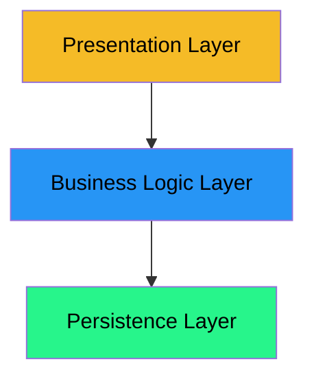

# The Problem: Domain Entities Leaking Between Layers

Let's examine what happens when we don't use DTOs and allow domain entities to leak between layers.

## Three-Layer Architecture Recap

Recall the three-layer architecture:



- **Presentation Layer**: User interface, controllers, views
- **Business Logic Layer**: Services, domain logic, business rules
- **Persistence Layer**: Data managers, file I/O, database access

The arrows show **dependency direction** - each layer depends on the layer below it, but not the other way around.

## The Problem: Direct Entity Usage

In many beginner applications, you might see code like this:

```java
// In the Presentation Layer (Controller)
public class PlanetController 
{
    private PlanetService planetService;
    
    public void displayAllPlanets() 
    {
        ArrayList<Planet> planets = planetService.getAllPlanets();  // Returns domain entities!
        
        for (Planet planet : planets) 
        {
            System.out.println(planet.getName());
            System.out.println(planet.getClimateDescription());
            // ... using Planet entity directly
        }
    }
}
```

This seems simple and works fine initially. But it creates several problems:

## Problem 1: Tight Coupling

The presentation layer is **directly coupled** to the domain entity structure:

```java
// If Planet entity changes...
public class Planet 
{
    private int id;
    private String name;
    private String climateDescription;  // What if this field is renamed?
    // ...
}
```

If the business logic layer renames `climateDescription` to `climateInfo`, the presentation layer breaks. The presentation layer shouldn't care about internal domain structure.

## Problem 2: Presentation Depends on Domain Structure

The presentation layer needs to know about:
- All fields in the entity (even ones it doesn't use)
- The entity's relationships (foreign keys, collections)
- The entity's methods and behavior

This violates the **principle of least knowledge** - the presentation layer knows too much.

## Problem 3: Changes Cascade

When you modify a domain entity, you might break multiple places:

```java
// Domain entity change
public class Planet 
{
    // Removed: private String climateDescription;
    // Added: private ClimateData climateData;  // More complex structure
    
    public ClimateData getClimateData() { ... }
}
```

Now **every** place in the presentation layer that used `getClimateDescription()` breaks. You have to update:
- All controllers
- All views
- All display methods
- All tests

## Problem 4: Domain Logic Leakage

Domain entities often have business logic methods:

```java
public class Planet 
{
    // ... fields ...
    
    public boolean isHabitable() 
    {
        return hasAtmosphere && hasLife && distanceFromStarAU < 2.0;
    }
    
    public double calculateTravelTime(double speed) 
    {
        // Complex calculation...
    }
}
```

If the presentation layer has access to these methods, it might:
- Call business logic methods directly (bypassing the service layer)
- Duplicate business logic in the presentation layer
- Create inconsistent behavior across the application

## Problem 5: Testing Difficulties

When layers are tightly coupled, testing becomes harder:

- You can't test the presentation layer without creating full domain entities
- You can't mock the business logic layer easily
- Changes to domain entities require updating many tests

## Example: The Space Explorer Case

In our Space Explorer system, imagine the presentation layer directly using `Mission` entities:

```java
// Presentation Layer
public class MissionController 
{
    private MissionService missionService;
    
    public void displayMission(int missionId) 
    {
        Mission mission = missionService.getMission(missionId);
        
        // Directly accessing domain entity
        System.out.println(mission.getMissionName());
        System.out.println(mission.getObjective());
        
        // Accessing foreign keys directly
        for (int explorerId : mission.getCrewIds()) 
        {
            // Need to resolve IDs manually in presentation layer!
            Explorer explorer = explorerService.findById(explorerId);
            System.out.println(explorer.getName());
        }
    }
}
```

**Problems:**
- Presentation layer needs to know about `crewIds` (foreign keys)
- Presentation layer has to resolve IDs itself
- Presentation layer depends on `ExplorerService` (multiple dependencies)
- If `Mission` structure changes, this code breaks

## The Solution: DTOs

Instead of exposing domain entities, the business logic layer should return **Data Transfer Objects**:

```java
// Business Logic Layer returns DTOs
public class MissionDTO 
{
    private int id;
    private String missionName;
    private String objective;
    private ArrayList<String> crewNames;  // Already resolved!
    // ... simple data, no business logic
}

// Presentation Layer only knows about DTOs
public class MissionController 
{
    private MissionService missionService;
    
    public void displayMission(int missionId) 
    {
        MissionDTO mission = missionService.getMission(missionId);
        
        // Simple, clean, no domain knowledge needed
        System.out.println(mission.getMissionName());
        System.out.println(mission.getObjective());
        
        for (String crewName : mission.getCrewNames()) 
        {
            System.out.println(crewName);
        }
    }
}
```

**Benefits:**
- Presentation layer doesn't know about foreign keys
- Presentation layer doesn't need to resolve IDs
- Presentation layer has fewer dependencies
- Changes to `Mission` entity don't break presentation (only mapping changes)

## Summary

- Direct use of domain entities creates **tight coupling** between layers
- Changes to domain entities **cascade** to presentation layer
- Presentation layer **knows too much** about domain structure
- Domain logic might **leak** into presentation layer
- Testing becomes **more difficult**

The solution is to use **DTOs** as a contract between layers. Next, we'll see what DTOs are and how they differ from domain entities.

