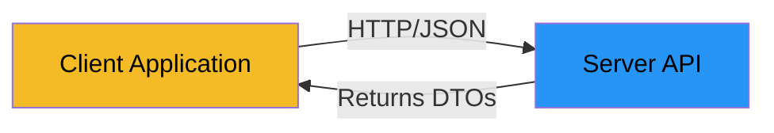

# DTOs in Client-Server Systems

So far, we've focused on DTOs in **standalone applications** with three layers. But DTOs are also essential in **client-server architectures**, where applications communicate over a network.

You will see this in another course, but I will just briefly mention it here.

## The Client-Server Architecture

In a client-server system, you have:

- **Client**: The application that users interact with (web browser, mobile app, desktop app)
- **Server**: The application that provides services and data (API server, web server)

They communicate over a network (internet, local network) using protocols like HTTP.

## Why DTOs Are Essential

In client-server systems, DTOs are **not just recommended - they're essential**. Here's why:

### 1. Entities Can't Be Sent Over Network

Domain entities often contain:
- Object references (can't be serialized)
- Complex relationships (circular references)
- Business logic methods (not needed on client)
- Internal state (shouldn't be exposed)

You can't send a Java object directly over the network. You need to convert it to a format like **JSON** or **XML**.

### 2. Security Concerns

Domain entities might contain:
- Sensitive data (passwords, internal IDs)
- Business logic that shouldn't be exposed
- Implementation details

DTOs allow you to control exactly what data is sent to the client.

### 3. Decoupling Client and Server

The client and server might be:
- Written in different languages (Java server, JavaScript client)
- Updated independently
- Developed by different teams

DTOs create a **contract** between client and server that both sides understand.

## Benefits in Client-Server

- ✅ **Serialization**: DTOs can be easily converted to JSON/XML
- ✅ **Security**: Only send what the client needs
- ✅ **Independence**: Client and server can evolve separately
- ✅ **Performance**: Send only necessary data, not entire object graphs
- ✅ **Compatibility**: Works across different programming languages

## Note

This is a brief overview. Client-server architectures, REST APIs, JSON serialization, and related topics are covered in more detail in networking and web development courses. For now, just remember: **DTOs are essential when sending data over a network**.

## Summary

- DTOs are **essential** in client-server systems (not just recommended)
- Entities can't be sent over network - they must be converted to DTOs
- DTOs are serialized to JSON/XML for APIs
- DTOs provide security and decoupling between client and server
- This topic is covered in more detail in networking/web courses

The same DTOs you use in standalone applications work perfectly in client-server systems!

