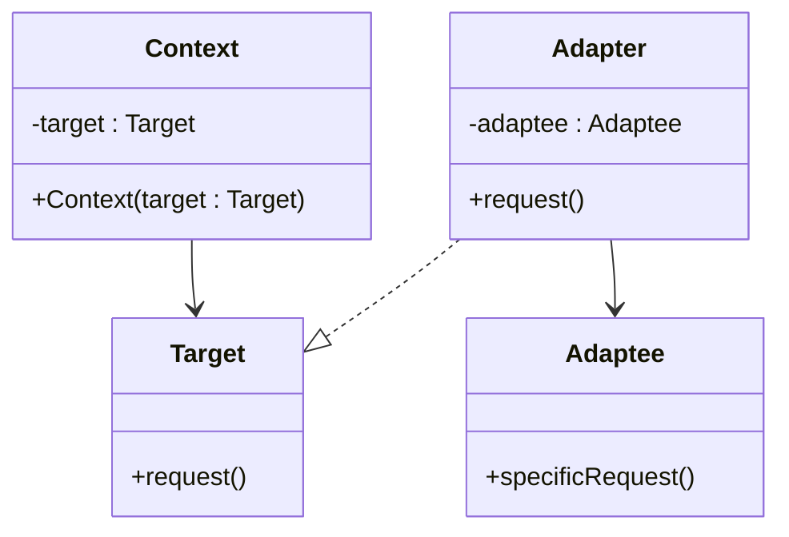

# The Pattern

The **Adapter** pattern converts the interface of an existing class into another interface that the context (your system) expects.\
It lets classes work together even when their APIs are incompatible.

## Intent

- Keep context code dependent on a stable interface (`Target`).
- Reuse existing/third-party classes (`Adaptee`) without modifying them.
- Isolate translation logic in one class (`Adapter`).

## Structure

This is the general structure of the pattern. The `Context` is part of your system, the `Target` is the interface your system expects, the `Adaptee` is the existing/third-party class with the incompatible API, and the `Adapter` is the class that translates the calls from the `Target` interface to the `Adaptee` interface.

Notice how we use Dependency Injection to inject the `Target` interface into the `Context` class. This is to avoid coupling the `Context` class to a specific implementation of the `Target` interface. It increases flexibility, as it is now possible to adapt another third-party class to the `Target` interface, and inject that instead, wihtout modifying the `Context` class. Again, this is pretty Strategy-like.

## Participants

**Comment:** Sometimes we talk about an _interface_, and sometimes we talk about the interface _of a class_, or the API of a class. In the latter case, we mean the set of public methods that the class exposes. I understand that this is confusing, but it is the way it is. Usually, it is clear from the context what is meant.

### Context
- Uses the `Target` interface.
- Does not know about the `Adaptee` class details.

### Target
- The interface expected by the `Context` class.
- Defines the operations the `Context` class is built around.

### Adaptee
- Existing/third-party class with useful behavior.
- Has an incompatible API compared to the `Target` interface.

### Adapter
- Implements the `Target` interface.
- Holds an `Adaptee` instance (composition), which is the existing/third-party class with the incompatible API.
- Translates method calls and data formats from the `Target` interface to the `Adaptee` interface.

## Pros and Cons

**Pros**
- **Reuse existing code**: Integrate legacy/third-party APIs without rewriting them.
- **Keep context code stable**: Business logic keeps depending on `Target`, not vendor-specific types.
- **Better testability**: You can mock `Target` in tests and test adapter logic independently.
- **Single translation point**: Conversion logic is centralized instead of duplicated.
- **Post-pone implementation details**: It let's you build out the meat of your context, without worrying about the implementation details of the interface. You just know what the interface promises, and you can build your context around that. Later, you can either create an implementation yourself, or find a third-party implementation. This let's the context work with its data without worrying about the format required by the `Target` implementation.

**Cons**
- **More classes**: Each incompatible API may need one or more adapters.
- **Extra indirection**: Debugging can involve one additional jump in the call chain.
- **Possible leaky abstractions**: If APIs differ too much, adapter methods may become awkward.
- **Not always worth it**: For tiny one-off integrations, direct mapping may be simpler.

## Consequences

Adapter improves flexibility and keeps boundaries clean, but it should be used where interface mismatch is meaningful and likely to persist.
If no mismatch exists, adding an adapter can be unnecessary complexity.
