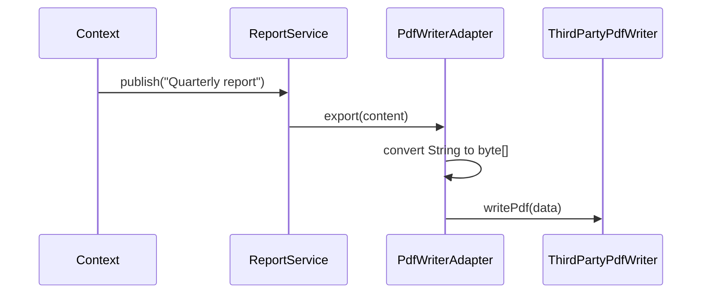

# Applying the Pattern

Now we solve the report-export mismatch from the previous chapter.
Goal: keep `ReportService` unchanged while integrating `ThirdPartyPdfWriter`.

## Step 1: Keep the Target Interface

Here is the target interface that `ReportService` expects.

```java
public interface ReportExporter {
    void export(String content);
}
```

## Step 2: Keep the Existing Adaptee

Here is the existing/third-party class with the incompatible API. I am just simulating the writing to PDF. You can imagine this is a third-party library that you cannot modify.

```java
public class ThirdPartyPdfWriter {
    public void writePdf(byte[] data) {
        System.out.println("Writing PDF bytes: " + data.length);
    }
}
```

## Step 3: Add an Adapter

Here is the adapter that implements the `ReportExporter` interface and translates the calls from the `Target` interface to the `Adaptee` interface.

```java
import java.nio.charset.StandardCharsets;

public class PdfWriterAdapter implements ReportExporter {
    private final ThirdPartyPdfWriter pdfWriter;

    public PdfWriterAdapter(ThirdPartyPdfWriter pdfWriter) {
        this.pdfWriter = pdfWriter;
    }

    @Override
    public void export(String content) {
        byte[] data = content.getBytes(StandardCharsets.UTF_8);
        pdfWriter.writePdf(data);
    }
}
```

The adapter translates `String` to `byte[]` and delegates the real work to `ThirdPartyPdfWriter::writePdf`.

## Step 4: Context Uses Target as Before

The `Context` class is unchanged. It still depends on the `ReportExporter` interface, and it does not know about the `ThirdPartyPdfWriter` class.

```java
public class ReportService {
    private final ReportExporter exporter;

    public ReportService(ReportExporter exporter) {
        this.exporter = exporter;
    }

    public void publish(String content) {
        // ... format and build the report...
        String report = ...;
        exporter.export(report);
    }
}
```

## Step 5: Wire It Together

```java
public class Main {
    public static void main(String[] args) {
        ThirdPartyPdfWriter adaptee = new ThirdPartyPdfWriter();
        ReportExporter exporter = new PdfWriterAdapter(adaptee);

        ReportService service = new ReportService(exporter);
        service.publish("Quarterly report");
    }
}
```

Once again, Dependency Injection is used to inject the `ReportExporter` interface into the `ReportService` class.

## Interaction Flow



## Result

- `ReportService` stays decoupled from the third-party class.
- Integration logic sits in one adapter class.
- Replacing the PDF library later only affects adapter wiring and implementation.
