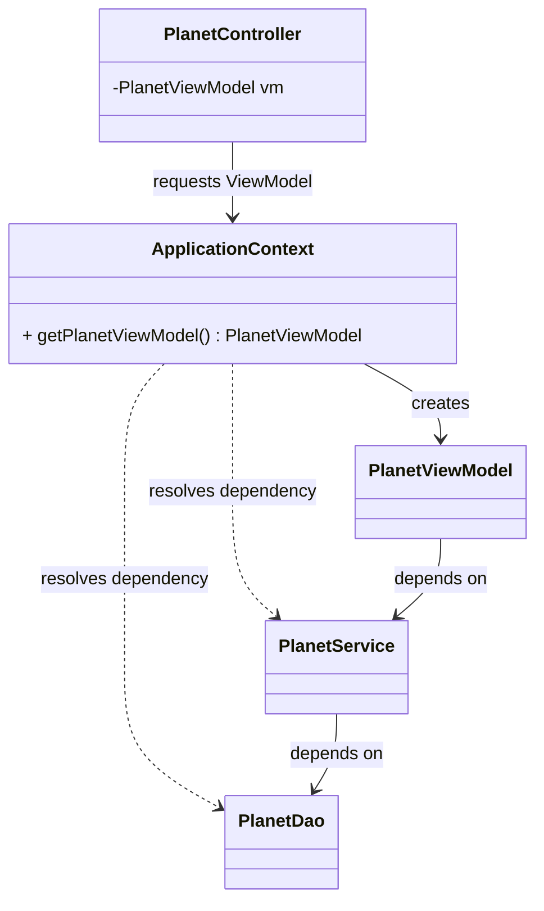

# The Pattern

The **Application Context** pattern centralizes object creation and dependency resolution in one place.

## Intent

- Provide one "composition root" for the application, i.e. the place where the application starts and is tied together.
- Build requested objects with all dependencies injected.
- Keep lifecycle decisions (shared vs per-request) explicit and consistent.
- Remove construction logic from controllers and business classes.

## Structure

The context acts as a _registry_ (a place to store the construction rules for types) plus _factory_ (a place to build the requested objects):

- it stores construction rules for types,
- it can store shared instances,
- and it resolves dependencies when building requested objects.

We are going to mix the pattern with a JavaFX ControllerFactory, and ViewManager. You have seen these in the previous semester.

But for a simplified example, assume here that a Controller gets access to the ApplicationContext, and requests the ViewModel from it.

## Participants

### ApplicationContext

- Knows how to create all services, DAOs, ViewModels, and other types.
- May keep shared instances.
- Resolves dependency chains when creating objects.

### Requested Type (for example ViewModel)

In more complex versions of the pattern, there is a single `getService` method, which can return any service type (here "service" is a very general term). The Application Context will then dynamically figure out what the requested service depends on and create those objects as well. If those objects have dependencies, the context will resolve them as well.

We will use a simplified version of the pattern, though, where this is just hardcoded, instead of dynamically resolved.

### Dependencies (services, DAOs, etc.)

- Normal classes with clear constructor dependencies.
- Also created or provided by the context.

## Consequences

### Benefits

- One place to understand and change wiring.
- Better separation of concerns across layers.
- Easier testing by swapping context configuration.
- Explicit lifecycle management (is a class a singleton, or a new instance is created for each request?).
- Each "service" is created in only a single place! It's a lot easier to change which kind of DAO implementation is used across the application.

### Costs

- The context itself can become large if not organized.
- If overused as a global lookup from everywhere, the pattern can drift toward a [service locator](https://en.wikipedia.org/wiki/Service_locator_pattern), which is sometimes seen as an anti-pattern.

## Variation Notes

This idea appears in many frameworks under similar names, but the core pattern is independent of framework choice. Here we focus on a plain Java, hand-written implementation.
