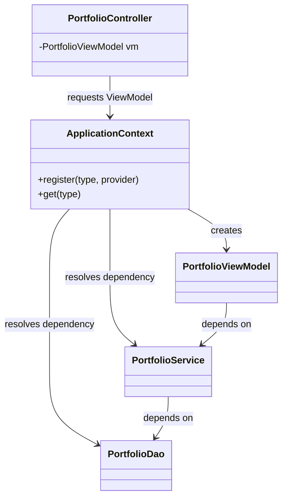

# The Pattern

The **Application Context** pattern centralizes object creation and dependency resolution in one place.

## Intent

- Provide one composition root for the application.
- Build requested objects with all dependencies injected.
- Keep lifecycle decisions (shared vs per-request) explicit and consistent.
- Remove construction logic from controllers and business classes.

## Structure

The context acts as a registry plus factory:

- it stores construction rules for types,
- it can store shared instances,
- and it resolves dependencies when building requested objects.

## Participants

### ApplicationContext

- Knows how to create registered types.
- May keep shared instances.
- Resolves dependency chains when creating objects.

### Requested Type (for example ViewModel)

- Asks for dependencies through constructor parameters.
- Does not know who created it.

### Dependencies (services, DAOs, etc.)

- Normal classes with clear constructor dependencies.
- Also created or provided by the context.

## Consequences

### Benefits

- One place to understand and change wiring.
- Better separation of concerns across layers.
- Easier testing by swapping context configuration.
- Explicit lifecycle management.

### Costs

- The context itself can become large if not organized.
- Poorly designed registration APIs can hide errors until runtime.
- If overused as a global lookup from everywhere, the pattern can drift toward a service locator anti-pattern.

## Variation Notes

This idea appears in many frameworks under similar names, but the core pattern is independent of framework choice. Here we focus on a plain Java, hand-written implementation.
