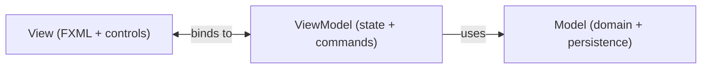

# Introduction to JavaFX MVVM

This learning path introduces MVVM (Model-View-ViewModel) in JavaFX with practical structure you can reuse in larger applications.

It is focused on architecture and collaboration between layers, not on Java syntax basics or JavaFX setup details.

## Prerequisites

You should already be comfortable with:

- basic JavaFX controls and event handling
- package structure in Java projects

## Goal of MVVM

The overall goal of MVVM is to separate the application into three parts:
- View: UI rendering
- ViewModel: UI logic
- Model: Business logic and persistence

This means that in our project we already have the model mostly in place.

We can diagram it like this:

## What this path covers

We will build from concept to implementation:

1. why MVVM is useful in JavaFX
2. strict responsibilities of Model, View, and ViewModel
3. ViewModel state with JavaFX properties
4. binding View and ViewModel
5. actions and validation patterns
6. navigation patterns in MVVM
7. controller factory + application context wiring
8. testing ViewModels in isolation

