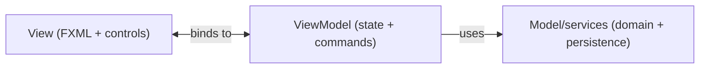

# Model, View, ViewModel responsibilities

MVVM is mostly about clear boundaries. This page defines the responsibilities and allowed dependencies.

## Responsibilities

## Model

The model represents application data and business rules:

- domain entities
- business services
- persistence abstractions/implementations

It should not know JavaFX classes. You should not have an import statement referencing anything from the javafx package.

In the three-layered architecture, the "model" is everything from the business logic layer and below.

## View

The view is UI structure and rendering:

- FXML or JavaFX nodes/layout
- visual state presentation

It is also responsible for forwarding user input to the ViewModel.

It should not contain business logic. Or ideally any kind of logic at all.

## ViewModel

The ViewModel is the presentation logic:

- exposes UI state through properties, e.g. what is the current username, status messages, is a button enabled or disabled, color of a label, etc.
- transforms model data for display, i.e. wrapping the data in properties, and maybe transforming it a little bit, for example converting a boolean to a string "Yes" or "No".
- handles user intent methods (save, search, select, etc.), i.e. the actions that the user can perform, like saving a form, searching for a user, selecting a planet, etc. Every button click should just result in a ViewModel method call.
- coordinates with services

It should not create UI controls or load FXML.

There are no TextFields, Buttons, Labels, etc. in the ViewModel.

## Dependency direction

Use this direction:

- View → ViewModel (binds to)
- ViewModel → Model/services (uses)

## Recap

In short:
* The Model is the business logic and persistence.
* The View is the UI rendering, and user input receiver.
* The ViewModel is the UI logic.
* The View should not contain business logic.
* The Model should not know JavaFX classes.