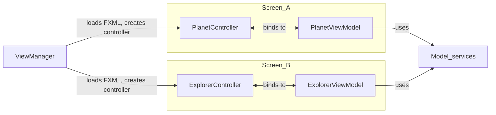

# Navigation in MVVM

Navigation can create tight coupling if controllers directly instantiate or call each other.

This page focuses on navigation responsibilities in MVVM and how to keep the architecture clean.

I will mostly reference theory introduced in other learning paths. You should already be familiar with the concepts.

## Existing implementation reference

I recommend again using a ViewManager, as introduced on first semester. You may read about it [here](https://troelsmortensen.github.io/Codelabs2/article/TroelsMortensen/Session%2022%20-%20JFX%20Continued), page 11.

This page builds on that approach instead of re-implementing it from scratch.

## Responsibility split

- **ViewModel**: decides that navigation should happen (intent), e.g. by calling a method on the ViewManager. Or using events, if you are feeling fancy. I have a video about this.
- **Navigation infrastructure** (`ViewManager`): performs actual view switch, i.e. loads the FXML file and creates the controller. Uses Application Context to setup the controller with the required ViewModel, etc.
- **Controller**: forwards user input and binds state

## Anti-patterns to avoid

- controller creating and calling another controller directly
- ViewModel importing UI classes (`Scene`, `Stage`, `FXMLLoader`)
- global static references to stage/view state from business logic

## Recap

In short:

* The ViewModel decides that navigation should happen (intent), e.g. by calling a method on the ViewManager. 
* The Navigation infrastructure performs actual view switch, i.e. loads the FXML file and creates the controller. Uses Application Context to setup the controller with the required ViewModel, etc.
