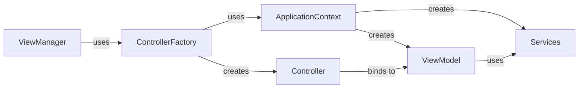

# Controller Factory and Application Context

As a JavaFX app grows, object creation and dependency wiring should be centralized.

This page connects `ControllerFactory` and `ApplicationContext` to MVVM composition.

I will mostly reference theory introduced in other learning paths, about ViewManager, ControllerFactory, and Application Context. You should already be familiar with the concepts.

## Existing implementation reference

References:
* ViewManager: [Video](https://troelsmortensen.github.io/Codelabs2/article/TroelsMortensen/Session%2022%20-%20JFX%20Continued?pagenumber=11
* ControllerFactory: [Video](https://troelsmortensen.github.io/Codelabs2/article/TroelsMortensen/Session%2023%20-%20JFX%20Application?pagenumber=5)
* Application Context: [Learning path](https://troelsmortensen.github.io/Codelabs2/article/TroelsMortensen/SDT%2FDesign%20Patterns%2FApplication%20Context%20Pattern)

This page combines the three above parts.

## Why combine them

- `ViewManager` knows when a view should be opened, and swaps out views. Uses ControllerFactory to create the controller classes.
- `ControllerFactory` knows how to construct controllers. Uses ApplicationContext to resolve dependencies.
- `ApplicationContext` knows how to resolve dependencies.

Together they keep construction logic out of controllers.

## Dependency flow

Now, we actually have two separate classes responsible for creating objects: the ControllerFactory and the ApplicationContext.
We _could_ merge them into one class, but I think it is better to keep them separate. The Controller classes are created in a slightly different way than the rest of the objects.

