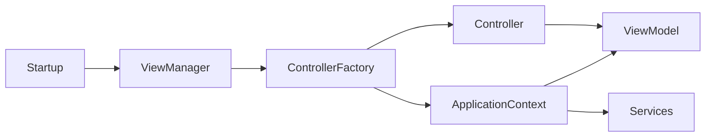

# Controller Factory and Application Context

As a JavaFX app grows, object creation and dependency wiring should be centralized.

This page connects `ControllerFactory` and `ApplicationContext` to MVVM composition.

## Learning objective

Understand how controllers, ViewModels, and services are resolved through a composition root using ControllerFactory and ApplicationContext.

## Existing implementation references

For ControllerFactory and ViewManager integration, see:

- `../../../Session 23 - JFX Application/005 Controller Factory.md`
- `../../../Session 23 - JFX Application/006 Exercise.md`

For Application Context pattern intent and implementation, see:

- `../Application Context Pattern/001 Introduction.md`
- `../Application Context Pattern/003 The Pattern.md`
- `../Application Context Pattern/004 Implementation.md`

## Why combine them

- `ViewManager` knows when a view should be opened
- `ControllerFactory` knows how to construct controllers
- `ApplicationContext` knows how to resolve dependencies

Together they keep construction logic out of controllers.

## Dependency flow

## Practical guideline

- register service and repository dependencies in one place
- let factory/context build controller with required ViewModel
- keep controller constructors focused on dependencies, not creation logic

If a controller does `new SomeService(...)`, move that wiring to the context/factory layer.

## Exit criteria

After this page, you can:

- explain the end-to-end construction flow from startup to controller
- justify why controllers should not build their own object graphs
- map Session 23 factory setup to the Application Context pattern
