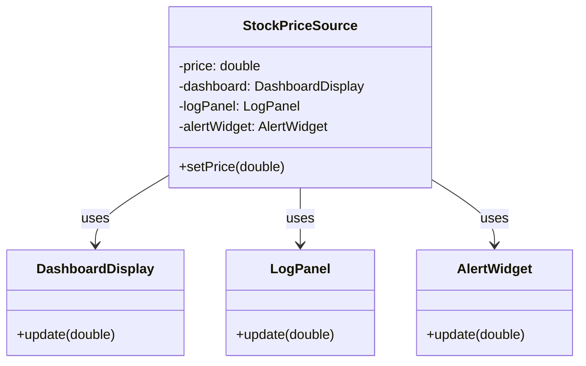

# The Problem

The Observer pattern addresses a common situation: **one object's state changes, and several other objects need to react**—update a display, log the change, send an alert, or keep derived data in sync.

## The Scenario

Imagine a **data source** that holds a value that changes over time—for example a stock price, a sensor reading, or a document model. Several **dependent components** need to stay in sync with that value:

- A **dashboard display** shows the current value.
- A **log panel** records each change.
- An **alert widget** checks the value and warns if it crosses a threshold.

When the data source changes, all of these must be updated. The question is: how does the source tell them?

## A Poor Solution: Direct References

A straightforward but brittle approach is for the "source" class to hold **direct references** to each concrete display or consumer. When its state changes, it explicitly calls each one:

```java
public class StockPriceSource {
    private double price;

    // Tight coupling: source knows every concrete listener type
    private DashboardDisplay dashboard;
    private LogPanel logPanel;
    private AlertWidget alertWidget;

    public void setPrice(double newPrice) {
        this.price = newPrice;
        dashboard.update(price);   // Must call each one explicitly
        logPanel.update(price);
        alertWidget.update(price);
    }
}
```

Here, `StockPriceSource` depends directly on `DashboardDisplay`, `LogPanel`, and `AlertWidget`. It has to know every type that cares about the price.

### Adding or Removing Listeners

To add a new component (for example a chart), you must:

1. Add a new field to `StockPriceSource`.
2. Add a call in `setPrice` (and in any constructor or setter that wires things up).

To remove a listener, you have to change the same class again. The source is **closed for extension** and **open for modification** every time the set of listeners changes.

## Why This Is Bad

- **Tight coupling**: The source depends on concrete listener types. It cannot be reused in a context where those classes do not exist.
- **Hard to add or remove listeners**: Every new or removed listener requires changing the source class.
- **Violates Open/Closed Principle**: You should be able to add new listeners without modifying the source. Here you cannot.
- **No clear abstraction**: There is no single "listener" concept; the source just has a list of specific objects it knows about.

## Visualizing the Problem

The source is tied directly to every concrete consumer:



The Subject (here, the source) should not depend on concrete listener types. The Observer pattern fixes this by introducing a **Listener** interface and letting the Subject depend only on that.
