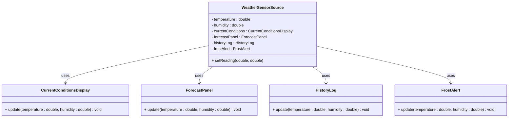

# The Problem

The Observer pattern addresses a common situation: **one object's state changes, and several other objects need to react** — update a display, log the change, send an alert, or keep derived data in sync.

## The Scenario

Imagine a **weather sensor** (subject) that reports **temperature** and **humidity** (e.g. two fields, updated when new readings arrive). Several **dependent components** (listeners) need to stay in sync with those readings:

- A **current conditions display** shows the latest temperature and humidity.
- A **forecast panel** uses the readings (e.g. for a simple forecast).
- A **history log** records each reading.
- A **frost alert** warns when temperature drops below a threshold (e.g. 0 °C).

When the sensor gets new readings, all four must be updated. The question is: how does the subject (weather sensor) tell them?

## A Poor Solution: Direct References

A straightforward but brittle approach is for the "subject" class, `WeatherSensorSource`, to hold **direct references**, or, associations, to each concrete Listener. When its state changes, it explicitly calls each one:

```java
public class WeatherSensorSource {
    private double temperature;
    private double humidity;

    // Tight coupling: subject knows every concrete listener type
    private CurrentConditionsDisplay currentConditions;
    private ForecastPanel forecastPanel;
    private HistoryLog historyLog;
    private FrostAlert frostAlert;

    // Constructor...

    public void setReading(double temperature, double humidity) {
        this.temperature = temperature;
        this.humidity = humidity;
        currentConditions.update(temperature, humidity);
        forecastPanel.update(temperature, humidity);
        historyLog.update(temperature, humidity);
        frostAlert.update(temperature, humidity);
    }
}
```

Here, `WeatherSensorSource` depends directly on `CurrentConditionsDisplay`, `ForecastPanel`, `HistoryLog`, and `FrostAlert`. It has to know every type that cares about the readings.

### Adding or Removing Listeners

To add a new component (for example a statistics panel), you must:

1. Add a new field to `WeatherSensorSource`.
2. Add a call in `setReading` (and in any constructor or setter that wires things up).

To remove a listener, you have to change the same class again. Every time the set of listeners changes, the subject class (weather sensor) must be modified. Inconvenient!

## Why This Is a Problem: Drawbacks and Consequences

Direct dependency is a problem not only in principle but in practice. Here are the main drawbacks, pitfalls, and consequences.

### Tight Coupling

The subject class **depends on concrete listener types**. That means:

- **Reuse is limited**: You cannot use the subject in another project or module that does not have `CurrentConditionsDisplay`, `ForecastPanel`, and so on. The subject drags all those classes in as compile-time dependencies.
- **Change ripples**: If a listener’s API changes (e.g. `update` gets an extra parameter), you must change the subject and every call site. The subject is tied to the listener’s concrete interface.

### Hard to Add or Remove Listeners

Every new component that needs the readings forces you to **edit the subject**:

- Add a new field.
- Add a call in `setReading` (and in constructors or setters that wire things up).
- If you remove a listener (e.g. you no longer need the history log in one deployment), you must change the subject again and redeploy.

So the **set of listeners is fixed at compile time**. You cannot attach or detach listeners at runtime without changing code. That makes it hard to support different configurations (e.g. “headless” mode with no displays, or a minimal UI with only current conditions).

### Violates Open/Closed Principle

The Open/Closed Principle says: *open for extension, closed for modification*. You should be able to add new behaviour (new listeners) without modifying existing code (the subject). With direct references, **every new listener requires modifying the subject**. The subject is closed for extension and open for modification. The opposite of what you want!

### No Single Abstraction

There is no unified “listener” concept. The subject just has a list of specific types it knows about. So:

- You cannot treat “all things that react to readings” in a uniform way (e.g. iterate over them, attach/detach via one interface).
- You cannot swap implementations (e.g. replace one display with another) without changing the subject’s fields and method calls.

### Pitfalls in Practice

- **Easy to forget a listener**: When adding a new consumer, developers may add the field but forget the call in `setReading`, so one display stays stale. The compiler does not help.
- **Order dependence**: If the order of calls matters (e.g. one listener assumes another has already run), the code is fragile and hard to reason about. There is no single “notification” point; you have a hard-coded sequence.
- **Testing**: To unit-test the subject, you must construct or mock all four listener types. You cannot test “subject notifies one listener” in isolation without bringing in the rest. More on this later in the course.


## Visualizing the Problem

The subject is tied directly to every concrete consumer:



The Subject (here, the subject) should not depend on concrete listener types. The Observer pattern fixes this by introducing a **Listener** interface and letting the Subject depend only on that.
