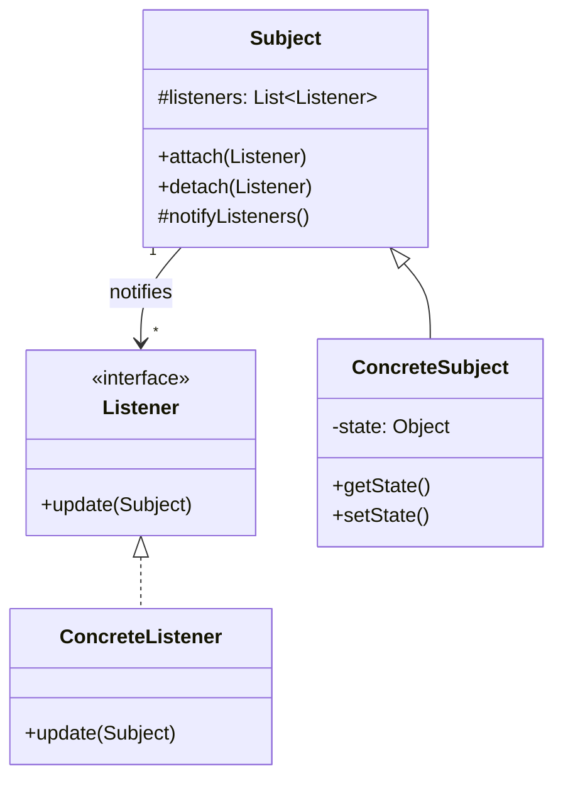

# The Pattern

The Observer pattern (here: Subject and Listener) defines a one-to-many dependency so that when the Subject's state changes, all Listeners are notified automatically, without the Subject knowing concrete listener types.

## Intent

- **Define a one-to-many dependency** between a Subject and its Listeners.
- When the **Subject's state changes**, all registered Listeners are **notified automatically**.
- The Subject depends only on a **Listener interface**, not on concrete listener classes.

This lets you add and remove listeners at runtime and keeps the Subject loosely coupled to whoever is listening.

## Structure

The following class diagram shows the roles: an abstract **Subject** that maintains a list of **Listener**s and notifies them; **ConcreteSubject** holds the actual state; **ConcreteListener** implements the reaction.

- **Subject** (abstract class): Holds a list of Listeners; provides `attach` and `detach`; calls `notifyListeners()` when state changes (typically from a subclass).
- **Listener** (interface): Defines `update(Subject)` so the Subject can notify without knowing concrete types.
- **ConcreteSubject**: Extends Subject; holds the actual state; in setters or mutators, updates state and then calls `notifyListeners()`.
- **ConcreteListener**: Implements Listener; in `update(Subject)` it reacts (e.g. reads from the subject and refreshes a display).

## Participants

### Subject (abstract class)

- Maintains a list of Listeners.
- Provides `attach(Listener)` and `detach(Listener)` to register and unregister.
- Provides `notifyListeners()` (typically protected) that iterates over the list and calls `update(this)` on each Listener.
- Does not know concrete listener types; only the Listener interface.

### Listener (interface)

- Defines the contract for "something that reacts to Subject changes."
- Single method, e.g. `void update(Subject source)`, so the listener can query the subject for the new state.

### ConcreteSubject

- Extends Subject.
- Holds the concrete state (e.g. a value, a model).
- When state changes (in a setter or other method), calls `notifyListeners()` so all attached listeners are notified.

### ConcreteListener

- Implements Listener.
- In `update(Subject)`, performs the concrete reaction: update a display, log, send an alert, etc.

## Consequences

**Benefits**

- **Loose coupling**: The Subject depends only on the Listener interface. It does not depend on concrete listener classes.
- **Runtime flexibility**: Listeners can be attached and detached at runtime without changing the Subject's code.
- **Broadcast communication**: The Subject notifies all listeners in one place (`notifyListeners()`); it does not need to know how many or what kind of listeners exist.
- **Open/Closed**: New listener types can be added by implementing the Listener interface; the Subject stays unchanged.

**Trade-offs**

- **Indirection**: Notification goes through the Listener interface; debugging "who reacted" may require following the listener list.
- **Order and side effects**: The Subject does not control the order in which listeners are notified. If listeners have side effects or depend on each other, you may need to document or enforce an ordering policy elsewhere.