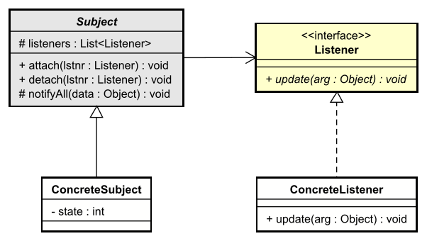

# The Pattern

The Observer pattern (here: Subject and Listener) defines a one-to-many dependency so that when the Subject's state changes, all Listeners can be notified, without the Subject knowing concrete listener types.

## Intent

- **Define a one-to-many dependency** between a Subject and its Listeners.
- When the **Subject's state changes**, all registered Listeners are **notified**.
- The Subject depends only on a **Listener interface**, not on concrete listener classes.

This:
* allows you to add and remove listeners at runtime
* allows you to add new listeners without modifying the Subject.
* allows you to test the Subject independently of the Listeners.
* allows you to add new _types_ of listeners without modifying the Subject.
* keeps the Subject loosely coupled to whoever is listening.

## Structure

The structure of the pattern comes with a few minor variations. But the core idea is the same.

The following class diagram shows the roles: an abstract **Subject** that maintains a list of **Listener**s and notifies them; **ConcreteSubject** holds the actual state (whatever that state is); **ConcreteListener** implements the reaction.

- **Subject** (abstract class): Holds a list of Listeners; provides `attach` and `detach` to register and unregister listeners; calls `notifyListeners()` when state changes (typically from a subclass).
- **Listener** (interface): Defines `update(Object)` so the Subject can notify with some data without knowing concrete types.
- **ConcreteSubject**: Extends Subject; holds the actual state; can update state and then notify listeners.
- **ConcreteListener**: Implements Listener. Uses `update(Object)` to react to the new state.

### Variations
Sometimes the `ConcreteListener` has a dependency on the `Subject`, this serves as a way for the Listener to attach/detach itself to the `Subject`.  
Alternatively, sometimes the `Listener::update()` method takes the `Subject` as a parameter. The `ConcreteListener` then has to call relevant get methods on the `ConcreteSubject` to get the new state. This approach, however, would tie the `ConcreteListener` to the `ConcreteSubject`, which is less ideal, though sometimes necessary.

In our case, Listeners will be attached from somewhere else. And they get the relevant data in the update() method.

## Participants

### Subject (abstract class)

- Maintains a list of Listeners.
- Provides `attach(Listener)` and `detach(Listener)` to register and unregister.
- Provides `notifyListeners()` (typically protected) that iterates over the list and calls `update(arg)` on each Listener. `arg` is usually of type object, so it can be anything. This makes the Subject and Listener reusable in other contexts, instead of having implement new specific versions for each case.
- Does not know concrete listener types; only the Listener interface.

### Listener (interface)

- Defines the contract for "something that reacts to Subject changes."
- Single method, e.g. `void update(Object arg)`, so the listener can receive the new state.

### ConcreteSubject

- Extends Subject.
- Holds the concrete state (e.g. a value, a model).
- When state changes (in a setter or other method), calls `notifyListeners(arg)` so all attached listeners are notified.

### ConcreteListener

- Implements Listener.
- In `update(Object arg)`, performs the concrete reaction: update a display, log, send an alert, etc.

## Consequences

**Benefits**

- **Loose coupling**: The Subject depends only on the Listener interface. It does not depend on concrete listener classes.
- **Runtime flexibility**: Listeners can be attached and detached at runtime without changing the Subject's code.
- **Broadcast communication**: The Subject notifies all listeners in one place (`notifyListeners()`); it does not need to know how many or what kind of listeners exist.
- **Open/Closed**: New listener types can be added by implementing the Listener interface; the Subject stays unchanged.

**Trade-offs**

- **Indirection**: Notification goes through the Listener interface; debugging "who reacted" may require following the listener list.
- **Order and side effects**: The Subject does not control the order in which listeners are notified. If listeners have side effects or depend on each other, you may need to document or enforce an ordering policy elsewhere.