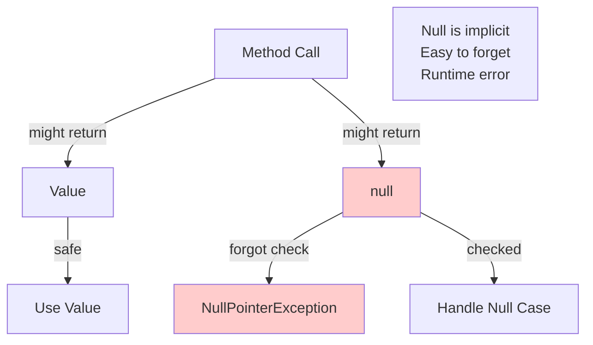

# The Problem: Null References

The Option pattern exists to solve a fundamental problem in programming: **how to represent the absence of a value**.

## The "Billion Dollar Mistake"

Tony Hoare, the creator of the null reference, called it his **"billion dollar mistake"**:

> "I call it my billion-dollar mistake. It was the invention of the null reference in 1965... This has led to innumerable errors, vulnerabilities, and system crashes, which have probably caused a billion dollars of pain and damage in the last forty years."

The problem is that `null` is **too easy to use incorrectly** and **too hard to detect when missing**.

## Problem 1: NullPointerException

The most common problem: forgetting to check for `null`:

```java
// Dangerous: No null check
public String getCity(User user) {
    return user.getAddress().getCity();  // NullPointerException if user or address is null!
}
```

**What can go wrong:**
- If `user` is `null` → `NullPointerException`
- If `user.getAddress()` returns `null` → `NullPointerException`
- The error only happens at **runtime**, not compile time

### Real-World Example

```java
public class UserService {
    public void sendWelcomeEmail(String userId) {
        User user = userRepository.findById(userId);  // Might return null
        String email = user.getEmail();  // NullPointerException if user is null!
        emailService.send(email, "Welcome!");
    }
}
```

**The bug:** If the user doesn't exist, `findById` returns `null`, and the code crashes.

## Problem 2: Not Explicit

`null` is **not explicit** in method signatures:

```java
// Does this return null? We don't know!
public User findUser(String id) {
    // Could return null, but it's not in the signature
    return userRepository.findById(id);
}

// Caller doesn't know if they need to check for null
User user = findUser("123");
String name = user.getName();  // Is this safe? We don't know!
```

**Problems:**
- Method signature doesn't tell you if `null` is possible
- Documentation might be wrong or missing
- Easy to forget to check
- No compiler warning if you forget

## Problem 3: Defensive Null Checking

To be safe, you need **defensive null checks everywhere**:

```java
// Defensive programming - lots of null checks
public String getCity(User user) {
    if (user == null) {
        return null;  // Or throw exception?
    }
    
    Address address = user.getAddress();
    if (address == null) {
        return null;  // Or throw exception?
    }
    
    return address.getCity();
}
```

**Problems:**
- **Verbose** - Lots of boilerplate code
- **Easy to miss** - Might forget a check
- **Inconsistent** - Different developers handle null differently
- **Unclear** - What should happen when null? Return null? Throw exception?

## Problem 4: Unclear Intent

When you see `null`, what does it mean?

```java
User user = findUser("123");
if (user == null) {
    // What does null mean here?
    // - User doesn't exist?
    // - Error occurred?
    // - Not yet loaded?
    // - Permission denied?
}
```

**Problem:** `null` doesn't tell you **why** there's no value. It could mean:
- Not found
- Error occurred
- Not yet initialized
- Permission denied
- Different reasons in different contexts

## Problem 5: Null Propagation

Null checks can create deeply nested code:

```java
// Deeply nested null checks
public String getShippingAddress(User user) {
    if (user != null) {
        Order order = user.getCurrentOrder();
        if (order != null) {
            Address address = order.getShippingAddress();
            if (address != null) {
                return address.toString();
            }
        }
    }
    return "No address available";
}
```

**Problems:**
- **Hard to read** - Deep nesting
- **Easy to make mistakes** - Miss a null check
- **Verbose** - Lots of boilerplate

## Problem 6: Null in Collections

Collections can contain `null` values:

```java
List<String> names = Arrays.asList("Alice", null, "Bob", null);

// Iterating is dangerous
for (String name : names) {
    System.out.println(name.toUpperCase());  // NullPointerException!
}

// Need defensive checks
for (String name : names) {
    if (name != null) {
        System.out.println(name.toUpperCase());
    }
}
```

**Problem:** Collections don't distinguish between "no value" and "null value."

## Problem 7: Null as a Valid Value

Sometimes `null` is a **valid value**, sometimes it's not:

```java
public class User {
    private String email;  // null means "not set" or "invalid"?
    private String middleName;  // null means "doesn't have one" (valid)
    
    // Which nulls are valid? Which are errors?
}
```

**Problem:** You can't tell from the type whether `null` is valid or an error.

## Real-World Example: The Chain of Nulls

Here's a common scenario that causes bugs:

```java
public class OrderService {
    public void processOrder(String orderId) {
        Order order = orderRepository.findById(orderId);  // Might be null
        User customer = order.getCustomer();  // NullPointerException if order is null
        String email = customer.getEmail();  // NullPointerException if customer is null
        Address address = customer.getAddress();  // Might be null
        String city = address.getCity();  // NullPointerException if address is null
        
        // Process order with city
        processWithCity(order, city);
    }
}
```

**The problem:** Any link in this chain can be `null`, causing a crash. You need null checks at every step.

## The Cost of Null

Null references cause:

1. **Runtime crashes** - `NullPointerException` is one of the most common exceptions
2. **Defensive code** - Lots of null checks everywhere
3. **Bugs** - Easy to forget a null check
4. **Unclear code** - Hard to understand what null means
5. **Testing burden** - Must test null cases everywhere
6. **Maintenance cost** - Null-related bugs are hard to find and fix

## Visualizing the Problem



## Summary

Null references cause:

1. **NullPointerException** - Runtime crashes when null is not checked
2. **Not explicit** - Method signatures don't indicate if null is possible
3. **Defensive code** - Lots of verbose null checks
4. **Unclear intent** - Null doesn't explain why there's no value
5. **Nested code** - Deep nesting from null checks
6. **Collection issues** - Null values in collections are dangerous
7. **Ambiguity** - Can't tell if null is valid or an error

**The solution:** The Option pattern makes absence **explicit and type-safe**, preventing these problems at compile time rather than runtime.

