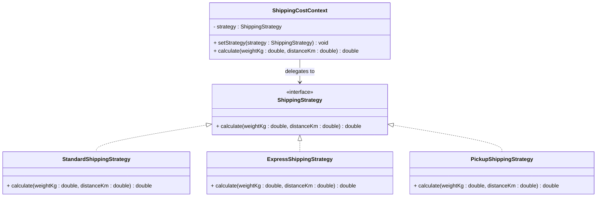

# The Pattern

## Intent

The **Strategy** pattern defines a family of algorithms, encapsulates each one, and makes them interchangeable. It lets the algorithm vary independently from clients that use it.  
In short, the pattern allows you to change the behavior of your software, by swapping out different implementations of a behavior.

## Structure

Strategy uses three core roles:

- **Context**: Holds a reference to a strategy and delegates work to it.
- **Strategy interface**: Defines the common operation.
- **Concrete strategies**: Different implementations of that operation.



## Participants

### Context

The Context is the class that uses the strategy. It holds a reference to a strategy object and delegates the work to it.  
In the above example, the `ShippingCostContext` class uses a `ShippingStrategy` object and delegates shipping cost calculation to it.

### Strategy

The Strategy interface defines the contract for all shipping policies. It is the common interface that defines the algorithm contract.

### Concrete Strategies

Implement specific policies such as standard, express, and pickup.

## Runtime Strategy Swapping

A key benefit is that the Context can switch algorithm objects at runtime. This is useful when behavior depends on user choice, configuration, environment, or feature flags.

Often, it is not the Context that decides which strategy to use, but rather the client that uses the Context. I.e. we use dependency injection to inject the strategy into the Context.  
In this case, the client is responsible for selecting the right strategy and injecting it into the Context.  
This is often done in the constructor of the Context class.

```java
public class ShippingCostContext {
    private ShippingStrategy strategy;
    public ShippingCostContext(ShippingStrategy strategy) {
        this.strategy = strategy;
    }
}
```

## Pros and Cons

### Pros

- **Open for extension**: Add new algorithms without modifying existing Context logic.
- **Better separation of concerns**: Each policy is isolated in its own class.
- **Easier testing**: Test each strategy independently with focused inputs.
- **Runtime flexibility**: Choose or replace algorithms dynamically.

### Cons

- **More classes**: Small systems may feel over-engineered.
- **Indirection**: You need to follow delegation to understand runtime behavior. And just looking at the code, it is not obvious which strategy is used.
- **Client coordination**: Something must select the right strategy at the right time.
- **Potential overhead**: Extra objects and abstraction can add minor complexity.

## Consequences

Strategy improves maintainability when behaviors vary frequently. It is most valuable when there are multiple stable alternatives and you expect change over time.

## When Not to Use Strategy

Do not introduce Strategy if you only have one stable algorithm and no realistic variation. In such cases, extra interfaces and classes add complexity with little benefit.
