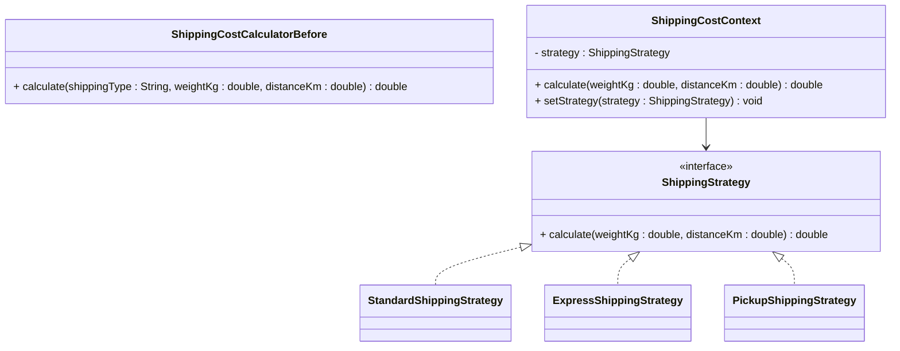

# Applying the Pattern

In the page, `2 The Problem`, shipping policies were hard-coded in a `switch` statement. Here we refactor that design using Strategy.

## Before: One Class with Branches

```java
public class ShippingCostCalculator {
    public double calculate(String shippingType, double weightKg, double distanceKm) {
        switch (shippingType) {
            case "STANDARD":
                return 5.0 + (weightKg * 0.8) + (distanceKm * 0.02);
            case "EXPRESS":
                return 12.0 + (weightKg * 1.2) + (distanceKm * 0.05);
            case "PICKUP":
                return 0.0;
            default:
                throw new IllegalArgumentException("Unknown shipping type: " + shippingType);
        }
    }
}
```

## After: Strategy-Based Design

### Strategy Interface

First, we need a strategy interface. It is the common interface that defines the algorithm contract.

```java
public interface ShippingStrategy {
    double calculate(double weightKg, double distanceKm);
}
```

### Concrete Strategies

Then, we need to implement the concrete strategies. These are the different implementations of the algorithm contract.\
In the above example, we have three concrete strategies: StandardShippingStrategy, ExpressShippingStrategy, and PickupShippingStrategy.

```java
public class StandardShippingStrategy implements ShippingStrategy {
    @Override
    public double calculate(double weightKg, double distanceKm) {
        return 5.0 + (weightKg * 0.8) + (distanceKm * 0.02);
    }
}

public class ExpressShippingStrategy implements ShippingStrategy {
    @Override
    public double calculate(double weightKg, double distanceKm) {
        return 12.0 + (weightKg * 1.2) + (distanceKm * 0.05);
    }
}

public class PickupShippingStrategy implements ShippingStrategy {
    @Override
    public double calculate(double weightKg, double distanceKm) {
        return 0.0;
    }
}
```

### Context

Lastly, we need to modify the context to use the strategy. We add a parameter to the constructor to inject the strategy, which is stored in a private field.\
The calculate method now delegates to the strategy.

```java
public class ShippingCostContext {
    private ShippingStrategy strategy;

    public ShippingCostContext(ShippingStrategy strategy) {
        this.strategy = strategy;
    }

    public void setStrategy(ShippingStrategy strategy) {
        this.strategy = strategy;
    }

    public double calculate(double weightKg, double distanceKm) {
        return strategy.calculate(weightKg, distanceKm);
    }
}
```

### Wiring and Using

Here we create a context and inject a strategy. Then we can calculate the shipping cost using the different strategies.

```java
public class CheckoutDemo {
    public static void main(String[] args) {
        ShippingCostContext context = new ShippingCostContext(new StandardShippingStrategy());
        System.out.println("Standard: " + context.calculate(2.5, 40));

        context.setStrategy(new ExpressShippingStrategy());
        System.out.println("Express: " + context.calculate(2.5, 40));

        context.setStrategy(new PickupShippingStrategy());
        System.out.println("Pickup: " + context.calculate(2.5, 40));
    }
}
```

## Refactor Mapping



## Summary

The refactor moves each shipping algorithm into its own class and lets the context delegate to a selected strategy. This makes the system easier to extend, test, and reason about over time.

