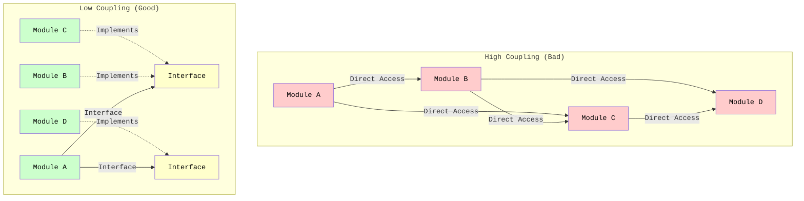

# Understanding Coupling

**Coupling** measures how much one module depends on or knows about another module. The goal is to achieve **low coupling** - modules should be as independent as possible.

## What is Coupling?

Coupling describes the **connections between** different parts of your system. When two modules are coupled, changes to one module may require changes to the other.

### The Core Idea

> **Low Coupling: Modules are independent and can change without affecting each other.**

Modules should interact through well-defined interfaces, not by knowing about each other's internal details.

## Types of Coupling

Coupling can be categorized from worst to best:

### 1. Content Coupling (Worst)

One module directly modifies or relies on the internal implementation of another module.

```java
// Bad: Content Coupling
public class Order {
    public List<Item> items;  // Public field - internal implementation exposed
}

public class OrderProcessor {
    public void processOrder(Order order) {
        // Directly accessing and modifying internal structure
        order.items.add(new Item());  // Violates encapsulation!
        order.items.remove(0);        // Knows about list implementation
    }
}
```

**Problems:**
- Changes to `Order.items` break `OrderProcessor`
- Violates encapsulation
- Cannot change implementation without breaking dependents

### 2. Common Coupling

Multiple modules share the same global data.

```java
// Bad: Common Coupling
public class GlobalState {
    public static String currentUser;  // Global state
    public static int orderCount;      // Shared by many modules
}

public class OrderService {
    public void createOrder() {
        GlobalState.orderCount++;  // Modifies global state
    }
}

public class ReportService {
    public void generateReport() {
        int count = GlobalState.orderCount;  // Reads global state
    }
}

public class UserService {
    public void login(String username) {
        GlobalState.currentUser = username;  // Modifies global state
    }
}
```

**Problems:**
- Changes to global state affect all modules
- Hard to track who modifies what
- Difficult to test (shared state)
- Unpredictable behavior

### 3. Control Coupling

One module controls the behavior of another by passing control information.

```java
// Bad: Control Coupling
public class OrderProcessor {
    public void processOrder(Order order, boolean applyDiscount, 
                           boolean sendEmail, boolean logTransaction) {
        if (applyDiscount) {
            applyDiscount(order);
        }
        if (sendEmail) {
            sendEmail(order);
        }
        if (logTransaction) {
            logTransaction(order);
        }
    }
}
```

**Problems:**
- Caller must know internal logic of the called module
- Adding new options requires changing the method signature
- Hard to understand what the method does

### 4. Stamp Coupling

Modules share a composite data structure, but only use part of it.

```java
// Bad: Stamp Coupling
public class User {
    private String name;
    private String email;
    private String address;
    private String phone;
    private String creditCard;
    // ... 20 more fields
}

public class EmailService {
    public void sendWelcomeEmail(User user) {
        // Only needs email, but receives entire User object
        sendEmail(user.getEmail(), "Welcome!");
    }
}
```

**Problems:**
- Module receives more data than it needs
- Changes to `User` may affect `EmailService` even if it doesn't use those fields
- Creates unnecessary dependencies

### 5. Data Coupling (Best)

Modules communicate only through simple data parameters.

```java
// Good: Data Coupling
public class EmailService {
    public void sendWelcomeEmail(String email) {
        sendEmail(email, "Welcome!");
    }
}

public class UserService {
    public void createUser(User user) {
        // Only passes the data needed
        emailService.sendWelcomeEmail(user.getEmail());
    }
}
```

An alternative is to use a data transfer object (DTO) instead of passing the entire `User` object.

**Benefits:**
- Modules are independent
- Changes to `User` don't affect `EmailService`
- Easy to test and understand

## Problems with High Coupling

### 1. Ripple Effects

Changes in one module require changes in many others:

```java
// High Coupling: Change ripples through system
public class Database {
    public void save(String table, Map<String, Object> data) {
        // Implementation
    }
}

public class UserRepository {
    public void saveUser(User user) {
        Map<String, Object> data = new HashMap<>();
        data.put("name", user.getName());
        data.put("email", user.getEmail());
        database.save("users", data);  // Coupled to Database implementation
    }
}

// If Database.save() changes, UserRepository must change
// If UserRepository changes, all code using it must change
```

### 2. Difficult Testing

High coupling makes it hard to test modules in isolation:

```java
// Hard to test because of coupling
public class OrderService {
    private Database database;  // Tightly coupled
    private EmailService emailService;  // Tightly coupled
    
    public void processOrder(Order order) {
        database.save(order);  // Requires real database
        emailService.send(order);  // Requires real email service
    }
}
```

### 3. Reduced Reusability

Coupled modules cannot be reused independently:

```java
// Cannot reuse OrderService without Database and EmailService
public class OrderService {
    private Database database;  // Specific implementation
    private EmailService emailService;  // Specific implementation
    
    // Cannot use this in a different context
}
```

### 4. Harder to Understand

High coupling makes it difficult to understand the system:

```java
// To understand OrderService, you must understand:
// - Database implementation
// - EmailService implementation
// - How they interact
// - What happens if one fails
public class OrderService {
    private Database database;
    private EmailService emailService;
    // Complex interactions
}
```

## Achieving Low Coupling

### 1. Use Interfaces and Abstractions

```java
// Good: Low Coupling through Interface
public interface IRepository {
    void save(Object entity);
}

public class OrderService {
    private IRepository repository;  // Depends on abstraction
    
    public void processOrder(Order order) {
        repository.save(order);  // Doesn't know about implementation
    }
}
```

### 2. Dependency Injection

```java
// Good: Dependencies injected, not created
public class OrderService {
    private IRepository repository;
    private IEmailService emailService;
    
    public OrderService(IRepository repository, IEmailService emailService) {
        this.repository = repository;
        this.emailService = emailService;
    }
}
```

### 3. Minimize Dependencies

```java
// Bad: Too many dependencies
public class OrderService {
    private Database database;
    private EmailService emailService;
    private LoggingService loggingService;
    private AnalyticsService analyticsService;
    private NotificationService notificationService;
    // ... 10 more dependencies
}

// Good: Minimal, focused dependencies
public class OrderService {
    private IRepository repository;
    private IEmailService emailService;
    // Only what's needed
}
```

### 4. Law of Demeter (Don't Talk to Strangers)

```java
// Bad: Talking through multiple objects
public class OrderService {
    public void processOrder(Order order) {
        // Violates Law of Demeter
        order.getCustomer().getAddress().getCity();
    }
}

// Good: Direct communication
public class OrderService {
    public void processOrder(Order order) {
        String city = order.getCustomerCity();  // Order provides what's needed
    }
}
```

## Visualizing Coupling




## Summary

Coupling measures how modules depend on each other:

- **High Coupling (Bad):** Modules are tightly connected, changes ripple through the system
- **Low Coupling (Good):** Modules are independent, changes are isolated

To achieve low coupling:
- Use interfaces and abstractions
- Inject dependencies
- Minimize dependencies
- Follow the Law of Demeter

Low coupling makes your code more maintainable, testable, and flexible.

